::: {.callout-note}
**参考书目**：*Introductory Lectures on Manifold Topology Signposts* (Thomas Farrell & Yang Su) — 一本非常舒适的入门书
:::

# 第一部分：拓扑广义庞加莱猜想

## 主要结果

### Smale 定理 (GPC: 拓扑广义庞加莱猜想)

::: {#thm-gpc}
## 广义庞加莱猜想
设 $M^m$ 是闭光滑流形，维数 $m \geq 5$。若 $M$ 是同伦球面，则 $M$ 同胚于球面。
:::

**主要工具** ($m \geq 5$)：h-Cobordism 定理

::: {#thm-hcobordism}
## h-Cobordism 定理
设 $W^m$ 是光滑的 h-cobordism，若 $W$ 单连通且维数 $m \geq 6$，则配边 $W$ 微分同胚于 $\partial^- W \times [0,1]$（相对于边界 $\partial^- W$）。
:::

### 怪球与 h-Cobordism 类

利用 h-cobordism 定理，对于单连通光滑流形（特别是光滑同伦球面），当 $n \geq 5$ 时有双射：

$$\frac{\{S^n \text{ 上的光滑结构}\}}{\text{微分同胚}} \longleftrightarrow \frac{\{n \text{ 维同伦球面}\}}{\{\text{h-cobordism}\}}$$

- **左边**：球面上所有光滑结构，即所有怪球构成的集合
- **右边**：所有同伦球面的配边类，记为 $\Theta^n$

**$\Theta^n$ 的群结构**：

| 运算 | 定义 |
|:---:|:---|
| 乘法 | 连通和 |
| 单位元 | $S^n$ 上的标准光滑结构 |
| 逆元 | 反转定向，记为 $-\Sigma$（在柱 $\Sigma \times I$ 的内部挖去 $D^{n+1}$ 即得所需配边）|

**$\Theta^n$ 的阶数**：

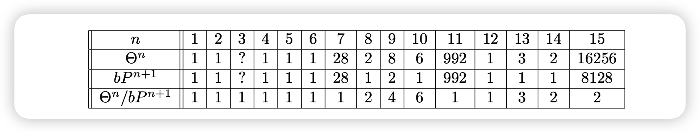{#fig-exotic-spheres}

这个表格给出了各维数上怪异球面的个数（$n \neq 4$），与伯努利数（数论中的量）密切相关。

::: {.callout-warning}
由于 h-cobordism 定理在 4 维失效（h-cobordism 类中的元素未必微分同胚），$\Theta^4$ 的阶数为 1 不能推出 4 维光滑庞加莱猜想。
:::

## GPC 的证明

本节假设 h-cobordism 定理成立，在此基础上给出 GPC 的证明。

### h-Cobordism 的定义

::: {#def-cobordism}
## Cobordism
一个 $(m+1)$ 维 cobordism 是流形 $W^{m+1}$，其边界可写成两部分的不交并：
$$\partial W = \partial^- W \sqcup \partial^+ W$$
此时称 $W$ 是从 $\partial^- W$ 到 $\partial^+ W$ 的配边。
:::

{#fig-cobordism-not-h}

::: {#def-h-cobordism}
## h-Cobordism
$(m+1)$ 维的 h-cobordism 是配边 $W^{m+1}$，满足含入映射
$$\partial^- W \hookrightarrow W, \quad \partial^+ W \hookrightarrow W$$
都是同伦等价。
:::

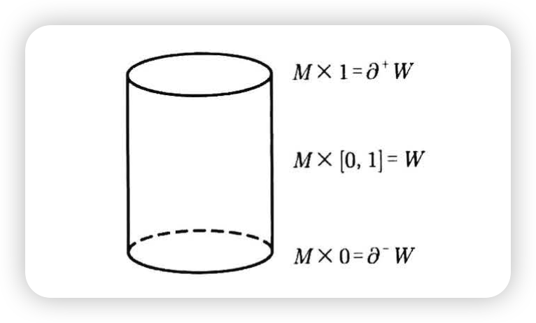{#fig-trivial-cobordism}

### h-Cobordism 定理

::: {#thm-hcobordism-formal}
## h-Cobordism 定理（完整表述）
设 $W^{m+1}$ 是光滑的 h-cobordism。若 $W$ 单连通且 $m \geq 5$，则
$$W \cong_{\text{diff}} \partial^- W \times [0,1] \quad (\text{rel } \partial^- W)$$
:::

### GPC 的证明 ($n \geq 6$)

::: {.proof}
设 $M^m$ 是光滑流形，维数 $\geq 6$ 且是同伦球面。

**Step 1.** 在 $M^m$ 上挖去两个隔开的 disk，得到配边 $W^m$。

{#fig-remove-disks}

**Step 2.** 由 @lem-homotopy-sphere-cobordism，$W$ 单连通且是光滑 h-cobordism。

**Step 3.** 应用 h-cobordism 定理：
$$W \cong_{\text{diff}} \partial^- W \times [0,1] = S^{m-1} \times [0,1] \quad (\text{rel } \partial^- W = S^{m-1})$$

**Step 4.** 重新粘回挖去的 disk：

- 利用相对微分同胚，将底部 disk 通过边界球面上的 identity 映射粘回，得到 $\mathbb{D}^m$
- 将顶部 disk 粘回（边界上的粘接映射可以是任意的）：
  - 这会影响光滑结构
  - 但不影响拓扑结构——仍同胚于 $S^m$

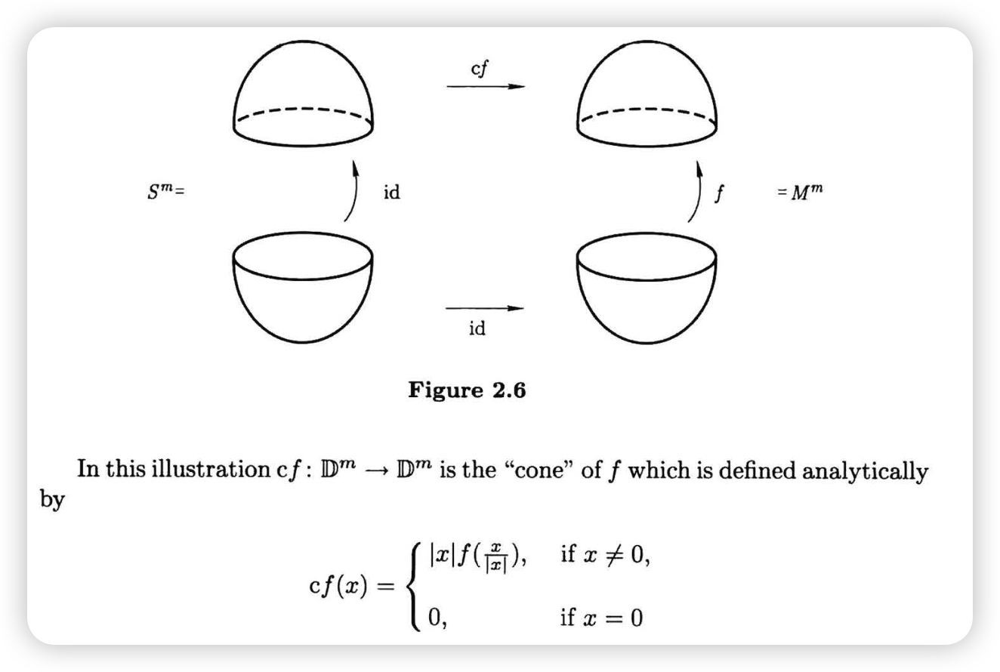{#fig-homeomorphism-construction}

**结论**：$M \approx S^m$。
:::

::: {#lem-homotopy-sphere-cobordism}
## 同伦球面上挖去两个 disk 得到 h-cobordism ($n \geq 6$)

**设置**：从同伦球面 $M$ 出发，挖去两个 disk $D^+, D^-$，得到配边 $W$。

{#fig-remove-disk-diagram}

::: {.proof}

**(I) 证明 $W$ 单连通**

需要从「$M$ 单连通」推出「$W$ 单连通」。

1. **$M$ 单连通 $\Rightarrow$ $W \cup D^+$ 单连通**：  
   对 triple $(M, W \cup D^+, D^-)$ 使用 Van Kampen 定理  
   （注意 $D^-$ 单连通，$D^- \cap (W \cup D^+) = S^{m-1}$ 单连通）

2. **$W \cup D^+$ 单连通 $\Rightarrow$ $W$ 单连通**：  
   对 triple $(W \cup D^+, W, D^+)$ 使用 Van Kampen 定理

**(II) 证明 $\partial^+ W \hookrightarrow W$ 是同伦等价**

1. **诱导同调群同构**：  
   对 triple $(W \cup D^+, W, D^+)$ 使用 Mayer-Vietoris 序列（注意 $W \cap D^+ = \partial^+ W$）
   
   ::: {.callout-tip}
   这里需要 $W \cup D^+$ 的同调群为 0，由 triple $(M, W \cup D^+, D^-)$ 的 Mayer-Vietoris 序列得到。
   :::

2. **使用 Homology Whitehead 定理**：

   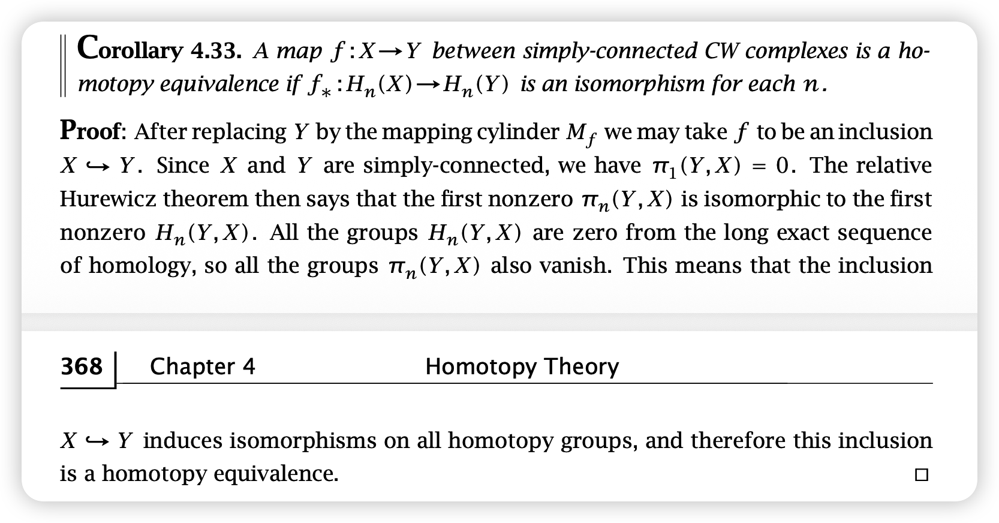{#fig-homology-whitehead}
   
   单连通 + 同调等价 $\Rightarrow$ 同伦等价

3. **结论**：$\partial^+ W \hookrightarrow W$ 是同伦等价

**(III)** $\partial^- W \hookrightarrow W$ 是同伦等价的证明类似。
:::

:::

### 附：Whitehead 定理

**问题**：如何证明两个拓扑空间同伦等价？

::: {#def-weak-homotopy-equiv}
## 弱同伦等价
称空间 $X, Y$ 弱同伦等价，如果存在映射 $f: X \to Y$，使得
$$f_*: \pi_i(X) \xrightarrow{\cong} \pi_i(Y) \quad \forall i$$
:::

::: {#thm-whitehead}
## Whitehead 定理
任意两个 CW 复形 $X, Y$，若弱同伦等价，则同伦等价。
:::

::: {.callout-important}
弱同伦等价不仅要求同伦群同构，还要求存在映射 $f$ 实现之。存在同伦群同构但不同伦等价的例子。
:::

::: {#thm-homology-whitehead}
## Homology Whitehead 定理
对于单连通空间，同调等价（映射诱导同调群同构）即可得到同伦等价。
:::

# 第二部分：h-Cobordism 定理的证明

## 预备知识

### Isotopy（同痕）

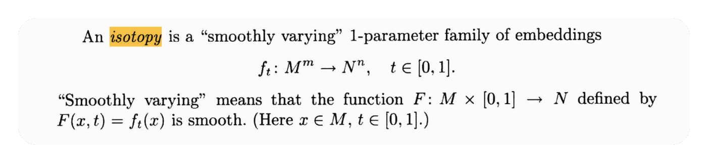{#fig-isotopy-def}

- 我们讨论的同痕总是**光滑同痕**
- 连续同痕不能区分纽结：

{#fig-continuous-isotopy}

## Handle 分解

（粘接映射的内容略）

## Handle 运算法则

### 同痕不变性

::: {#prp-isotopy-extension}
## 同痕扩张定理
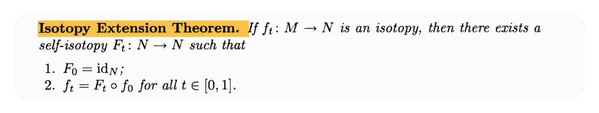{#fig-isotopy-extension}
:::

::: {#lem-isotopy}
## 同痕引理
将 handle $h$ 粘到流形 $M$ 上时，若使用同痕的粘接映射 $f, g: \partial^- h \to \partial M$，则得到的流形同胚：
$$M +_f h \cong M +_g h$$
:::

::: {.proof}
{#fig-isotopy-lemma-proof}
:::

### 粘接顺序的交换性

#### 基本概念

::: {#def-attaching-complementary}
## Attaching sphere 与 Complementary sphere
Handle 一般写成乘积 $D^i \times D^{n-i}$：

| 部分 | 名称 | 子空间 | 边界 |
|:---:|:---:|:---:|:---:|
| 第一分量 | Attaching part | $D^i \times \{0\}$ (attaching disk) | Attaching sphere $\mathscr{S}$ |
| 第二分量 | Complementary part | $\{0\} \times D^{n-i}$ (complementary disk) | Complementary sphere $\mathcal{S}$ |
:::

{#fig-attaching-complementary}

#### Thom 横截性定理

考虑三元组 $(W, M, N)$，其中 $M, N$ 是 $W$ 的子流形。

::: {#thm-thom-transversality}
## Thom 横截性定理

1. 可在 $W$ 内做微小扰动（同痕），使 $M, N$ 横截相交
2. 若 $M, N$ 横截相交，则
   $$\dim M + \dim N = \dim W + \dim(M \cap N)$$
:::

::: {#exm-thom}
设 $\dim W = 3$，$\dim M = \dim N = 1$。由定理，可扰动使 $M, N$ 横截相交，此时
$$\dim(M \cap N) = 1 + 1 - 3 = -1 \implies M \cap N = \varnothing$$
:::

::: {.callout-tip}
## 启示
可通过控制维数保证子流形不相交。
:::

#### Lemma：顺序引理 {#lem-order}

::: {#lem-order-lemma}
## 顺序引理
考虑 $(M + h_1) + h_2$。若 $h_2$ 的粘接球面 $\mathscr{S}$ 与 $h_1$ 的补球面 $\mathcal{S}$ 不相交（它们都是 $\partial^+(M + h_1)$ 的子流形），则可交换粘接顺序：
$$(M + h_1) + h_2 \cong (M + h_2) + h_1$$
此时记作 $M + (h_1 \sqcup h_2)$。
:::

::: {.proof}
若不相交，可在 $\partial(M + h_1)$ 上挖去补球面 $\mathcal{S}$，将 $\partial^- h_2$ 收缩到 $\partial M$ 上。

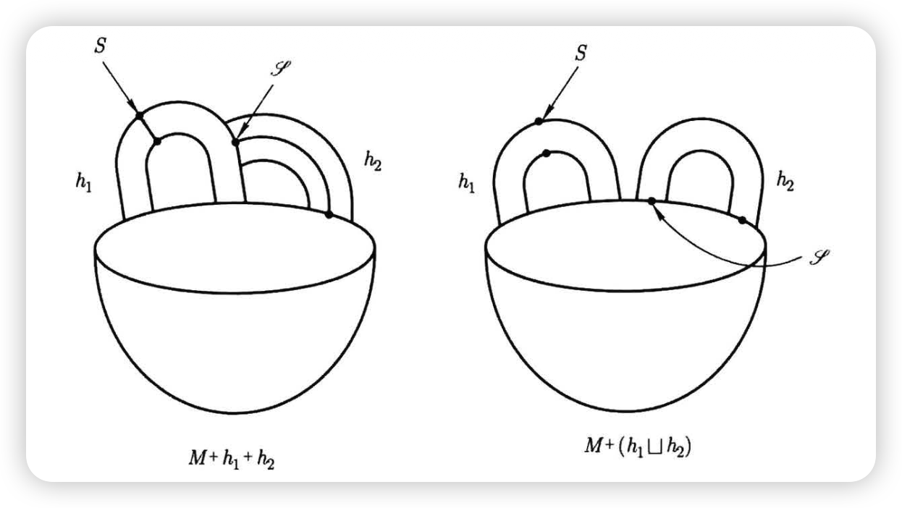{#fig-order-lemma-proof}
:::

::: {#cor-index-order}
若 $\mathrm{index}(h_2) \leq \mathrm{index}(h_1)$，则
$$M + h_1 + h_2 = M + (h_1 \sqcup h_2) = M + h_2 + h_1$$
即总可从 index 更小的 handle 开始粘接。
:::

::: {.proof}
设 $\mathrm{index}(h_1) = i_1$，$\mathrm{index}(h_2) = i_2$，$i_2 \leq i_1$。

- 补球面维数：$(n - i_1) - 1$
- 粘接球面维数：$i_2 - 1$
- 维数之和：$n - i_1 + i_2 - 2 \leq n - 2$

两者都是 $\partial(M + h_1)$（维数 $n-1$）的子流形。由 Thom 横截性定理，相交维数为 $(n-2) - (n-1) = -1$，即可做同痕使两者不相交。由 @lem-order-lemma 得证。
:::

::: {.callout-note}
## 约定
以后总假设按 index 从小到大粘接。Index 相同时，粘接顺序可交换（或认为同时进行）。
:::

**标准分解**：

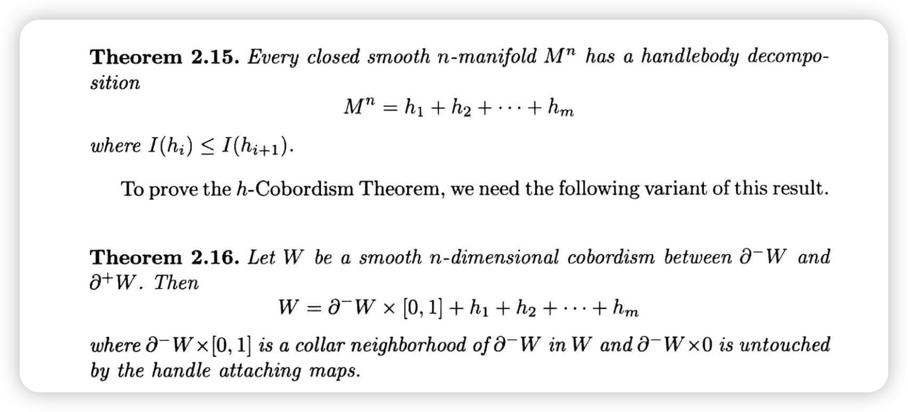{#fig-standard-decomp-1}

{#fig-standard-decomp-2}

### 几何与代数消解

#### 几何消解的例子

粘接相邻维数的 handle 时，有时会出现消解现象：

{#fig-geometric-cancel-1}

在 $M$ 上粘接 0-handle $h_1$ 和 1-handle $h_2$，结果可收缩到 $M$。关键观察：$h_1$ 的补球面与 $h_2$ 的粘接球面恰好相交于 **1 点**。

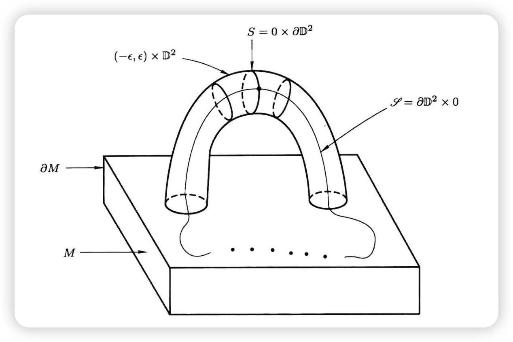{#fig-geometric-cancel-2}

#### 几何消解

::: {#lem-geometric-cancel}
## 几何消解
对于 $M + h_1 + h_2$，若 $h_2$ 的粘接球面 $\mathscr{S}$ 与 $h_1$ 的补球面 $\mathcal{S}$ **恰好横截相交于一点**，则
$$M + h_1 + h_2 \cong M$$
:::

::: {.callout-note}
由 Thom 横截定理，这只发生在 $\mathrm{index}(h_2) = \mathrm{index}(h_1) + 1$ 时。
:::

::: {.proof}
将 handle $h_1$ 分割成两部分，于是 $h_1, h_2$ 被分割成三部分 $A, B, C$（都是 $D^3$）：

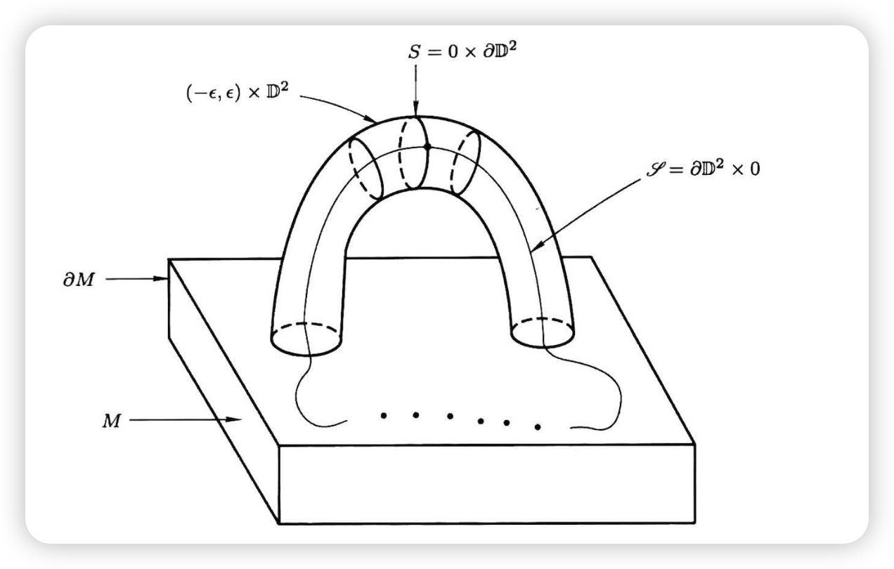{#fig-split-1}

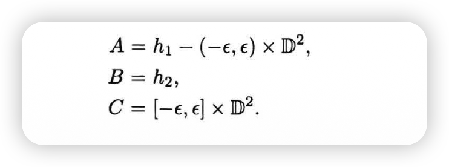{#fig-split-2}

粘接两个 handle 等同于 $((M \cup A) \cup B) \cup C$。关注交集：

{#fig-intersection}

沿 $D^2$ 粘 $D^3$ 不改变拓扑（想象立方体放在桌面上）：

{#fig-topology-unchanged}

故 $M + h_1 + h_2 \cong M$。
:::

#### 代数消解 / Whitney Trick

考虑 @lem-geometric-cancel 的情形，但改为考虑**代数相交数**：
$$\sigma(\mathcal{S}, \mathscr{S}) := \sum_{x \in \mathscr{S} \cap \mathcal{S}} \sigma(x)$$

::: {#lem-algebraic-cancel}
## 代数消解（Whitney Trick）
**条件**：设 $N = \partial(M + h_1)$ 单连通，$\dim M = n \geq 6$，$\mathrm{index}(h_1) = i$ 满足 $2 \leq i \leq n - 3$。

**结论**：若代数相交数为 $\pm 1$，则粘接映射 $f: \partial^- h_2 \to N^{n-1}$ 可同痕到 $f'$，使新粘接球面 $\mathscr{S}'$ 与 $\mathcal{S}$ 的**几何相交数为 1**。
:::

由 @lem-geometric-cancel，得 $M + h_1 + h_2 \cong M$。

::: {.proof}
只需证明可消去相邻的、符号相反的两个交点。设这两点为 $x, y$：

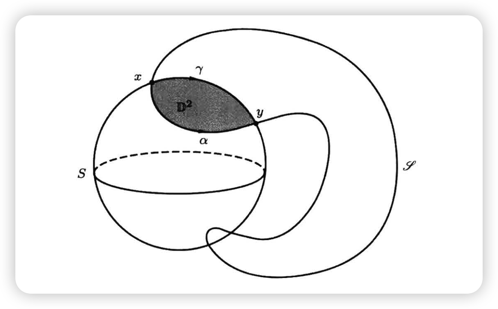{#fig-whitney-trick}

1. 分别在 $\mathscr{S}$ 和 $\mathcal{S}$ 上用 arc 连接 $x, y$，使两 arc 在 $x, y$ 外无交点，得到一个 loop

2. 由 $N$ 单连通，此 loop bounds 一个拓扑 disk $D^2$

3. 由 Whitney 嵌入定理（Thom 横截性定理）及 $n \geq 6$，可假设 $D^2$ 光滑嵌入 $N$
   
   ::: {.callout-tip}
   ## 嵌入的说明
   要证不自交，将 $D^2$ 微小平移得 $(D^2)'$，需保证 $D^2 \cap (D^2)' = \varnothing$。由于 $\dim N = n - 1 \geq 5$，两 disk 维数和为 $4$，相交维数为 $4 - 5 = -1$，即无交点。
   :::

4. 沿 embedded $D^2$ 将 $\mathscr{S}$ 落入 $\mathcal{S}$ 的部分"划出去"，交点减少两个，代数相交数不变

5. 从最里面的交点对开始，逐步往外操作，最终将交点减少到 1 个

6. 使用 @lem-geometric-cancel 完成证明。
:::

### Handle Addition

限制到只有 $i$-handle 和 $(i+1)$-handle 的情形。

#### 复杂情形的处理

对于 $M + h_1 + h_2$（$\mathrm{index}(h_2) = \mathrm{index}(h_1) + 1$），已有几何/代数相交数的方法。

但实际情形更复杂：有若干 $i$-handle 和若干 $(i+1)$-handle，相交方式复杂。

**问题**：考虑 $M + h_1^i + h_2^i + h_3^{i+1}$，若 $h_1, h_2$ 满足消解条件，可得
$$M + h_1 + h_2 + h_3 = (M + h_1 + h_2) + h_3 = M + h_3$$
但 **$h_3$ 的粘接球面如何变化**？

答案由 **incidence matrix**（关联矩阵）$D^{i+1}$ 给出。

#### 定义：Incidence Matrix $D^{i+1}$

设有 $m_i$ 个 $i$-handle，补球面为 $\mathcal{S}_1, \ldots, \mathcal{S}_{m_i}$；有 $m_{i+1}$ 个 $(i+1)$-handle，粘接球面为 $\mathscr{S}_1, \ldots, \mathscr{S}_{m_{i+1}}$。

::: {#def-incidence-matrix}
## Incidence Matrix
$$D^{i+1}_{j,k} := \sigma(\mathcal{S}_j, \mathscr{S}_k) \quad \text{(代数相交数)}$$
得到 $m_i \times m_{i+1}$ 矩阵 $D^{i+1}$。
:::

::: {.callout-note}
Incidence matrix 蕴含了 handle 分解的全部信息。
:::

**与同调群的联系**：

- 流形的 handle 分解形变收缩后得到 cell 分解
- 链复形由 $n$-handle 生成的自由 Abel 群构成
- 微分映射 $C_{i+1} \to C_i$ 恰为 incidence matrix $D^{i+1}$

#### Handle Addition

::: {#lem-handle-addition}
## Handle Addition
可改变 $(i+1)$-handle 的 attaching sphere，保持粘出结果不变。例如，将 $\mathscr{S}_1$ 改为
$$\mathscr{S}_1' = \mathscr{S}_1 \mathbin{\#} \mathscr{S}_2$$
则 $M +_{\mathscr{S}_1} h_1 + \cdots \cong M +_{\mathscr{S}_1'} h_1 + \cdots$
:::

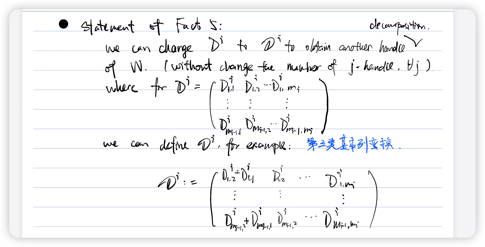{#fig-handle-addition}

**对关联矩阵的影响**：第三类基本列变换（第一列加上第二列）。

::: {.callout-note}
**条件**：当 index 为 $i, i+1$ 时，要求 $2 \leq i \leq n - 3$。
:::

::: {.proof}
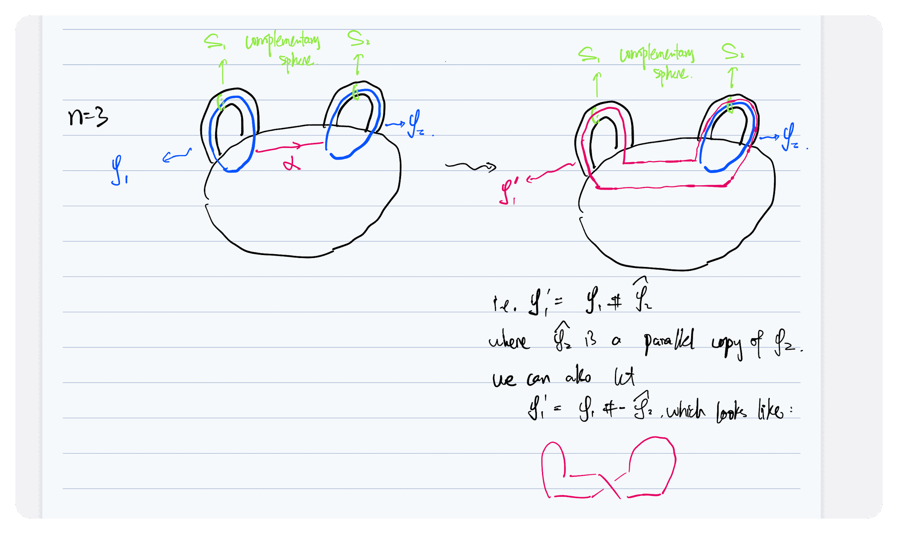{#fig-handle-add-proof-1}

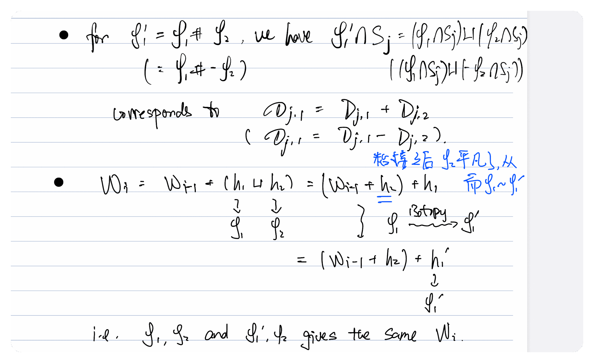{#fig-handle-add-proof-2}
:::

::: {.callout-note}
不仅可以加法，还可以减法（与反定向粘接球面做连通和）。因此 **@lem-handle-addition 允许对关联矩阵做第三类基本变换**。
:::

**关于 index 限制的说明**：

证明的关键步骤是找 arc $\alpha$，需要 $\alpha$ 与其他粘接球面、补球面都不相交。

- **粘接球面**（维数 $i - 1$）：需 $n - 1 > 1 + (i - 1)$，即 $i \leq n - 2$
- **补球面**（维数 $n - i$）：需 $n - 1 > (n - i) + 1$，即 $i \geq 3$

综合得 $3 \leq i \leq n - 2$，即对 $(i-1)$-handle 有 $2 \leq i - 1 \leq n - 3$。

### h-Cobordism 定理的证明

#### Proposition：Regular Handle 分解的存在性

::: {#prp-regular-decomposition}
## Regular Handle 分解的存在性
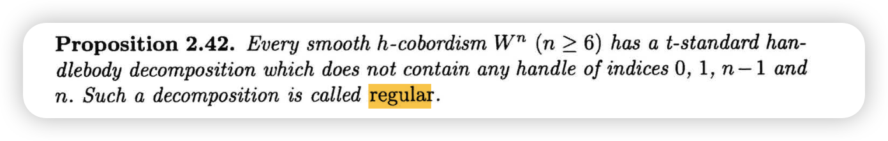{#fig-prop-2-42}
:::

**动机**：在 @lem-algebraic-cancel 和 @lem-handle-addition 中，考虑 $i, i+1$ handle 时要求 $2 \leq i \leq n - 3$。因此 handle 的 index 落在 $[2, n-2]$ 区间内，需先排除区间外的 handle——这就是 regular form 的意义。

#### h-Cobordism 定理的证明

设 $W^n$ 是 h-cobordism，取 $W$ 的 regular handle 分解：
$$W = \partial^- W \times [0,1] + h_1 + h_2 + \cdots + h_m$$

**核心命题**：若 $m > 0$，则存在另一个 regular handle 分解，具有更少的 handle。

::: {.callout-tip}
若此命题成立，取 $m$ 最小的 regular 分解，则 $m = 0$，即 $W = \partial^- W \times [0,1]$。
:::

::: {.proof}
## 核心命题的证明

**Step 1.** 设所有 handle 中 index 最小者为 $i - 1$，考虑所有 $(i-1)$-handle 和 $i$-handle。

**Step 2.** 考虑 $H_{i-1}(W, \partial^- W)$：

- 由同伦等价 $\partial^- W \hookrightarrow W$ 及相对长正合序列，此同调群为 0
- 由胞腔同调，$H_{i-1} = C_{i-1} / \mathrm{Im}(D^i)$，故 $D^i$ 是满射，即**满秩**

**Step 3.** 对矩阵 $D^i$ 做初等变换：

- 第一类基本行列变换 + 第三类基本列变换 → 上三角矩阵 $\mathscr{D}^i$
- 由满射性，对角元为 $\pm 1$
- 再做第三类列变换 → **对角矩阵**

**例**：

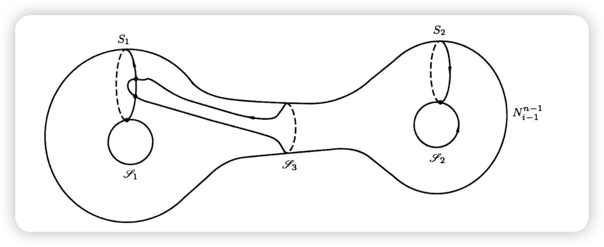{#fig-matrix-1}

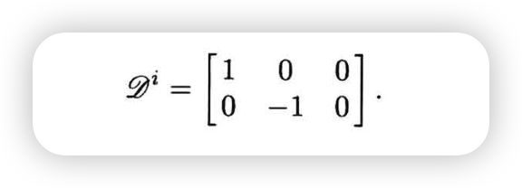{#fig-matrix-2}

**Step 4.** 在对角矩阵上使用 @lem-geometric-cancel 和 @lem-algebraic-cancel，减少 handle 个数。
:::

#### 补充命题

为使证明完整，需补充：

::: {#prp-supplement-1}
## 命题 1 (Prop 2.42)
任意 h-cobordism $W$ 都有 regular handle 分解（不含 0, 1, $n-1$, $n$-handle）。
:::

::: {#prp-supplement-2}
## 命题 2
$\pi_1(N_{i-1}) = 1$。
:::

#### Lemma 2.45

::: {#lem-2-45}
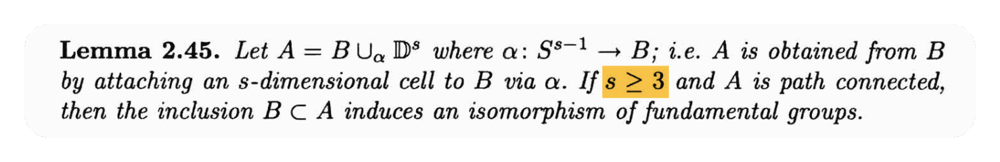{#fig-lemma-2-45}
:::

取 $X = A - \{0\} \simeq B$（$0$ 为粘接 cell 的中心），$Y = \mathrm{int}(D^s)$，则
$$X \cap Y = S^{s-1}, \quad X \cup Y = A$$
对 triple $(A, A - \{0\}, \mathrm{int}(D^s))$ 使用 Van Kampen 定理即证。

#### 命题 2 的证明：$\pi_1(N_{i-1}) = 1$

粘接 $i$-handle 在同伦上等同于粘接 $i$-cell，可用 @lem-2-45。

**策略**：分别将 $N_{i-1}$ 和 $W$ 与 $W_{i-1}$ 联系起来。

::: {.proof}
**(I) $W$ 与 $W_{i-1}$**：

$W$ 是在 $W_{i-1}$ 上粘接若干 index $\geq i$ 的 handle。由 $i - 1 \geq 2$，有 $i \geq 3$，故
$$\pi_1(W) \cong \pi_1(W_{i-1})$$

**(II) $N_{i-1}$ 与 $W_{i-1}$**：

由于只关心同伦型，考虑 $N_{i-1} \times I$ 与 $W_{i-1}$。

- $W_{i-1}$ 是在 $\partial^- W \times I$ 上粘接若干 $(i-1)$-handle
- 取对偶：$W_{i-1}$ 是在 $N_{i-1} \times I$ 上粘接若干 index 为 $n - (i-1) = (n-i) + 1 \geq 3$ 的 handle

故 $\pi_1(N_{i-1}) \cong \pi_1(W_{i-1})$。

**(III)** 由 $W$ 单连通，综合得 $\pi_1(N_{i-1}) = 1$。
:::

#### 命题 1 的证明：Regular Handle 分解总存在

**策略**：

1. 证明 0, 1-handle 可消解
2. 利用对偶原理，$(n-1)$, $n$-handle 也可消解

**对偶论证框架**：给定任意 handle 分解 $t$：

| 步骤 | 操作 | 结果 |
|:---:|:---|:---|
| 1 | 在 $t$ 中消解 0, 1-handle | $t_1$ |
| 2 | 对 $t_1$ 做对偶 | $t_2$ |
| 3 | 在 $t_2$ 中消解 0, 1-handle（= 消解 $t_1$ 的 $n{-}1$, $n$-handle）| $t_3$ |
| 4 | 对 $t_3$ 做对偶 | $t_4$（不含 0, 1, $n{-}1$, $n$-handle）|

##### 消解 0-Handle

由 $W$ 是 h-cobordism，有 $H_0(W, \partial^- W) = 0$，即空间连通。

因此，对于任意 0-handle，都有**唯一的** 1-handle 将其与 $\partial^- W \times I$ 所在的"主要部分"连接（其他 index 的 handle 无法使空间连通）。

这意味着 $D^1$ 天然是对角矩阵（事实上是单位阵），可直接消解所有 0-handle。

##### 消解 1-Handle (Handle Trading)

**核心思想**：用 **handle trading** 消解所有 1-handle。过程不改变 handle 总数——用 3-handle 替换 1-handle。

**准备工作**：

- 由于 0-handle 已消解，1-handle 直接粘接到 $\partial^- W \times I$ 上
- 每个 1-handle 给出一个 loop
- 在 $W_2$ 上考虑（与 $W$ 差若干 index $\geq 3$ 的 handle，基本群一致）
- 由 @prp-supplement-2 的策略，$\partial^+ W_2$ 单连通

**构造过程**：

::: {.proof}
**Step 1.** 对任意 1-handle $h_1$，考虑其在 $\partial^+ W_2$ 上形成的 loop。

**Step 2.** 由 $\pi_1(\partial^+ W) = 1$，此 loop bounds a disk $D^2$。

由 Thom 横截性定理 + dimension argument，可假设 $D^2$ 嵌入到 $\partial^+ W$ 中。记 $\partial D^2 = \mathscr{S}_0$。

**Step 3.** 由 @lem-geometric-cancel，引入一对互相消解（几何相交数为 1）的 handle：

- 2-handle $h_2$
- 3-handle $h_3$

使得 $W_2 = W_2 + h_2 + h_3$。同时要求 $h_2$ 避开 $D^2$ 和 $W_2$ 上其他 2-handle。

记 $h_2$ 的粘接球面为 $\mathscr{S}_2$。

**Step 4.** 取连通和
$$\mathscr{S}_2' := \mathscr{S}_2 \mathbin{\#} \mathscr{S}_0$$
记对应的 2-handle 为 $h_2'$。

{#fig-handle-trading}

**关键观察**：

1. 由于 $\mathscr{S}_0$ bounds a disk，有 $\mathscr{S}_2' \sim \mathscr{S}_2$
2. $\mathscr{S}_2'$ 与 $h_1$ 的补球面**几何相交数为 1**

**消解计算**：

$$
\begin{aligned}
W_2 &= W_2 + h_2 + h_3 \\[6pt]
    &= W_2 + h_2' + h_3 \\[6pt]
    &= \partial^- W \times I + \cdots + (h_1 + h_2') + \cdots + h_3 \\[6pt]
    &= \partial^- W \times I + \cdots + h_3
\end{aligned}
$$

**结论**：1-handle $h_1$ 被替换为 3-handle $h_3$。
:::
