**关键词：** framed link；Kirby calculus；ribbon Hopf algebra；ribbon category；modular category；Reshetikhin--Turaev invariant

# 引言

Jones polynomial 的发现把 knot theory、Lie theory 与 quantum groups 联系起来。Reshetikhin 与 Turaev 的工作进一步说明，这种联系并不止于 $S^3$ 中的 link invariants：在合适的 root of unity 情形下，quantum group 的表示论还可以通过 surgery presentation 产生 closed oriented $3$-manifold 的拓扑不变量 （Reshetikhin–Turaev 1991）。Turaev 后来的系统表述则把这种构造放入 ribbon category 与 modular category 的框架中 （Turaev 1994）。

本文按照"几何侧、代数侧、三维流形不变量"的顺序组织。几何侧解释为什么 framed link 足以描述 closed oriented $3$-manifold；代数侧解释 Hopf algebra 的结构如何对应 tangle diagram 的局部构件；最后说明 modular data 如何保证由 link invariant 写出的 surgery expression 对 Kirby moves 不变。

本文采用如下约定。三维流形均为 closed oriented $3$-manifold；link 默认嵌入 $S^3$ 中；从 Hopf algebra 出发时，表示范畴默认取有限秩表示。我们只讨论半单（或经 purification 后半单）的 modular category 构造，不涉及非半单的 Hennings、Lyubashenko 或 modified trace 型推广。

记号大体沿用 Turaev 1994 年的教材 （Turaev 1994）（以下简称 T94）。

# Framed link 与 closed 3-manifold 的几何来源

## Framing 与 writhe 的关系

设 $L$ 是 $S^3$ 中的 oriented link。一个 framing 是 $L$ 的法丛的一个平凡化，也就是沿每个分量取一个处处非零的法向量场并考虑其同伦类。对 $S^3$ 中的 oriented knot 而言，framing 可以用一个整数记录；这个整数可理解为给定 framing longitude 与 Seifert longitude 的差。

在图示计算中，经常把 framing 转换成 writhe 的信息。具体地说，给定一个 link diagram $D$，blackboard framing 把每条线段加厚为贴近平面的 ribbon。此时 framing 由图中的 twisting 反映出来；给 diagram 加一个正 curl 或负 curl 会使 writhe 改变 $\pm 1$，同时也改变 blackboard framing。因而，在采用 blackboard framing 的约定下，可以用 writhe 来代表 framing，并把 framed link 视为 ribbon link 的平面图示。

这一点解释了为什么 RT 构造自然使用 framed link 而不是普通 link：ribbon category 中的 twist 正是代数侧记录 framing 的结构。

## 四维 handlebody 视角

本文把四维 handlebody 视角作为 framed link 出现的主要几何来源。令 $B^4$ 是四维球，且 $\partial B^4=S^3$。若 $L=L_1\cup\cdots\cup L_m$ 是 $\partial B^4$ 中的 link，并给每个分量 $L_i$ 指定一个整数 framing $n_i$，则可以沿 $L$ 的各分量附加 $2$-handles，得到四维 $2$-handlebody $$W_L=B^4\cup_L\bigcup_i(D^2\times D^2).$$ 这里每个 attaching map 的 framing 决定了 $\partial D^2\times D^2$ 如何贴到 $\partial B^4$ 的 tubular neighborhood 上。所得四维流形的边界 $\partial W_L$ 是一个 closed oriented $3$-manifold。

通常也把 $\partial W_L$ 说成由 $S^3$ 沿 framed link $L$ 做 integer Dehn surgery 得到的三维流形，并记为 $$M_L=S^3_L(n_1,\ldots,n_m)=\partial W_L.$$ 本文不需要把 Dehn surgery 作为独立定义；只需记住它与上述 $2$-handle attachment 的边界描述等价。

::: theorem
**定理 1** (Lickorish--Wallace surgery theorem). *任意 closed connected oriented $3$-manifold $M$ 都有一个 integer surgery presentation：存在 $S^3$ 中的 link $L=L_1\cup\cdots\cup L_m$ 以及整数 framings $n_1,\ldots,n_m$，使得 $$M\cong S^3_L(n_1,\ldots,n_m).$$ 等价地，任意 closed connected oriented $3$-manifold 都可由 $S^3$ 中某个 framed link 的 integer surgery 得到。*
:::

::: theorem
**定理 2** (Rohlin cobordism theorem). *任意 closed oriented $3$-manifold $M$ 都是某个 compact oriented $4$-manifold $W$ 的边界： $$\partial W=M.$$ 换言之，oriented cobordism group $\Omega^{SO}_3$ 为 $0$。进一步地，我们可以要求 $W$ 由 $B^4$ 附加 $2$-handles 得到，即 $W=W_L$。*
:::

上面两个定理是等价的。因此，若要构造 closed oriented $3$-manifold invariant，可以从 framed link 出发。但 framed link 表示并不唯一，因此还需要处理不同 handle diagrams 之间的等价关系。

## Kirby calculus

Kirby calculus 描述了不同 framed links 何时给出同一个三维流形。它的几何含义是：改变四维 handle decomposition 的方式不应改变其边界三维流形。

::: theorem
**定理 3** (Kirby calculus). *设 $L$ 与 $L'$ 是 $S^3$ 中的 framed links。则 $M_L$ 与 $M_{L'}$ orientation-preservingly homeomorphic 当且仅当 $L$ 与 $L'$ 可通过有限次 framed isotopy、handle slides 以及 $\pm 1$-framed unknot 的加入或删除相互变换。*
:::

<figure data-latex-placement="H">
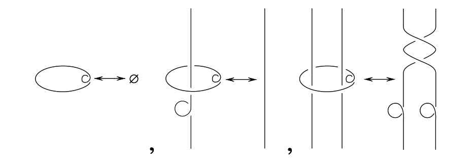
<figcaption>Kirby moves 的局部示意：在 surgery diagram 中加入或删除特定 framed unknot，以及将一个分量沿另一个分量滑过，都不改变所得三维流形。</figcaption>
</figure>

在 link diagram 中，handle slide 表现为一个分量沿另一分量做 band sum；$\pm 1$ move 表现为加入或删除一个与其余分量不交的 $\pm 1$-framed unknot。Turaev 在 RT 构造中使用的是等价版本的 Kirby moves。无论采用哪一套生成元，结论都是：若一个由 surgery link 写出的数量要成为三维流形不变量，它必须在 Kirby moves 下保持不变。

# Ribbon category 与 graphical calculus

## Ribbon category 的定义

为了把 framed link diagram 转化成线性代数，需要一个能够解释 crossing、cup、cap 与 twist 的范畴结构。我们分几步来搭：先是 monoidal category，再加上 braiding 和 duality，最后把它们合起来得到 ribbon category。

::: definition
**定义 4** (strict monoidal category). *本节采用 strict 约定。一个 strict monoidal category $\mathcal C$ 带有 bifunctor $$\otimes:\mathcal C\times\mathcal C\to\mathcal C$$ 和单位对象 $\mathbf 1$，满足 $$(U\otimes V)\otimes W=U\otimes(V\otimes W),\qquad
  \mathbf 1\otimes V=V=V\otimes\mathbf 1.$$ 一般非 strict 的情形中，上式应改为 associativity 与 unit constraints；Mac Lane coherence 允许我们在图示计算中按 strict 情形书写。*
:::

::: definition
**定义 5** (braiding). *设 $\mathcal C$ 是 strict monoidal category。一个 braiding 是一族对对象 $V,W$ 自然的同构 $$c=\{c_{V,W}:V\otimes W\longrightarrow W\otimes V\}_{V,W\in\mathcal C},$$ 满足两条 hexagon identity： $$c_{U,V\otimes W}
  =
  (\operatorname{id}_V\otimes c_{U,W})\circ(c_{U,V}\otimes\operatorname{id}_W),$$ $$c_{U\otimes V,W}
  =
  (c_{U,W}\otimes\operatorname{id}_V)\circ(\operatorname{id}_U\otimes c_{V,W}),$$ 以及自然性：对任意 $f:V\to V'$ 与 $g:W\to W'$， $$(g\otimes f)\circ c_{V,W}
  =
  c_{V',W'}\circ(f\otimes g).$$ 配有 braiding 的 monoidal category 称为 braided monoidal category。*
:::

由定义立刻能得到两条常用事实。其一，在两条 hexagon identity 中取 $V=W=\mathbf 1$ 以及 $U=V=\mathbf 1$，再用 $c$ 的可逆性，就有 $$c_{V,\mathbf 1}=c_{\mathbf 1,V}=\operatorname{id}_V.$$ 其二，这些公理蕴含 Yang--Baxter（braid relation）恒等式 $$(\operatorname{id}_W\otimes c_{U,V})\circ(c_{U,W}\otimes\operatorname{id}_V)\circ(\operatorname{id}_U\otimes c_{V,W})
  =
  (c_{V,W}\otimes\operatorname{id}_U)\circ(\operatorname{id}_V\otimes c_{U,W})\circ(c_{U,V}\otimes\operatorname{id}_W).$$ 直观上，$c_{V,W}$ 是把 $V$-colored strand 从 $W$-colored strand 上方穿过去的代数解释：两条 hexagon identity 保证 crossing 与张量积相容，而 Yang--Baxter 恒等式在图示上正好是三条 strand 的 Reidemeister III 同痕（见后面的 graphical calculus 一节）。

::: definition
**定义 6** (duality / rigid structure). *设 $\mathcal C$ 是 strict monoidal category。这里说的 duality，是给每个对象 $V$ 指定一个对象 $V^*$ 以及两个态射 $$b_V:\mathbf 1\to V\otimes V^*,
  \qquad
  d_V:V^*\otimes V\to\mathbf 1,$$ 满足 zig-zag identities $$(\operatorname{id}_V\otimes d_V)\circ(b_V\otimes\operatorname{id}_V)=\operatorname{id}_V,$$ $$(d_V\otimes\operatorname{id}_{V^*})\circ(\operatorname{id}_{V^*}\otimes b_V)=\operatorname{id}_{V^*}.$$ 这里 $b_V$ 是 coevaluation，$d_V$ 是 evaluation。具有这种 duality 的 monoidal category 常称为 rigid category。注意此处并不预先要求 $(V^*)^*=V$；在 ribbon category 中，这一点会由兼容性给出一个 canonical identification。*
:::

::: definition
**定义 7** (ribbon category). *一个 ribbon category 是一个 monoidal category $\mathcal C$，配有 braiding $c$、twist $\theta$ 以及与它们相容的 duality $(\,^*,b,d)$。其中 twist 是一族自然同构 $$\theta_V:V\to V,$$ 满足 $$\theta_{V\otimes W}
  =
  c_{W,V}\circ c_{V,W}\circ(\theta_V\otimes\theta_W).$$ duality 与 braiding、twist 之间的兼容性则要求 $$(\theta_V\otimes\operatorname{id}_{V^*})\circ b_V
  =
  (\operatorname{id}_V\otimes\theta_{V^*})\circ b_V,$$ 也就是常写成的 $\theta_{V^*}=(\theta_V)^*$。因此，ribbon category 正是能够同时解释 crossing、cup/cap 和 framing twist 的范畴结构。*
:::

## Colored ribbon graph

::: definition
**定义 8** (colored ribbon graph). *设 $\mathcal C$ 是一个 ribbon category。一个 ribbon graph 是三维流形中的紧定向曲面，分解为有限个 directed bands、directed annuli 和 coupons：bands 可看作加厚的有向边，annuli 可看作加厚的闭边，coupons 是带有若干输入、输出边的矩形节点。一个 $\mathcal C$-colored ribbon graph 是一个 ribbon graph，并附加如下标签：*

1.  *每条 directed band 或 annulus 标以 $\mathcal C$ 中的一个对象 $V$；若方向反转，则颜色改为对偶对象 $V^*$；*

2.  *每个 coupon 标以 $\mathcal C$ 中的一个 morphism，其 source 和 target 分别由 coupon 下方、上方边界上相遇的 colored strands 的张量积给出；*

3.  *isotopy 必须保持 ribbon graph 的分解、方向和 colors。*
:::

普通的 colored framed link 是最简单的例子：它没有 coupons，每个 link component 被加厚为一个 annulus，并标以某个对象 $V\in\mathcal C$。framing 被 annulus 的嵌入方式记录；这就是为什么 RT 构造自然处理 framed links 而不是 unframed links。

## Graphical calculus

Graphical calculus 指的是把 colored ribbon graph 的平面图示系统地翻译成 $\mathcal C$ 中 morphisms 的规则。具体地，先把图示切成局部生成元，再把它们替换为范畴中的结构态射： $$\begin{array}{c|c}
\text{图示局部构件} & \text{范畴解释}\\
\hline
\text{identity strand} & \operatorname{id}_V\\
\text{positive/negative crossing} & c_{V,W}\text{ 或 }c_{V,W}^{-1}\\
\text{cup/cap} & \text{coevaluation/evaluation}\\
\text{positive/negative twist} & \theta_V\text{ 或 }\theta_V^{-1}\\
\text{coupon} & \text{coupon 上标记的 morphism}
\end{array}$$

这些规则可以用下面几张图来读。一个带标签的 coupon 表示一个 morphism；多输入、多输出的 coupon 表示一般 morphism $$f:V_1\otimes\cdots\otimes V_m\longrightarrow
  W_1\otimes\cdots\otimes W_n.$$ 图元上下连接对应 morphism 的复合，并列放置对应 tensor product。

<figure data-latex-placement="H">

 

<figcaption>Coupon 表示 morphism；一般 coupon 允许多个输入与多个输出。</figcaption>
</figure>

<figure data-latex-placement="H">

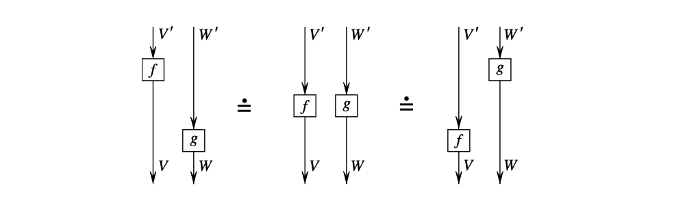 
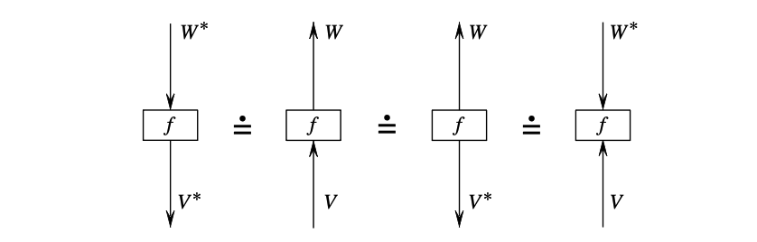

<figcaption>水平并列表示 tensor product；改变 strand 的方向时，颜色改为对偶对象。</figcaption>
</figure>

braiding 与 twist 是 framed link 图示中最重要的两个局部操作。Crossing 被读成 $c_{V,W}$ 或 $c_{V,W}^{-1}$；一圈正负 twist 被读成 $\theta_V$ 或 $\theta_V^{-1}$。因此，framing 的改变不是额外信息，而是已经由 ribbon category 的 twist 记录在代数中。

<figure data-latex-placement="H">

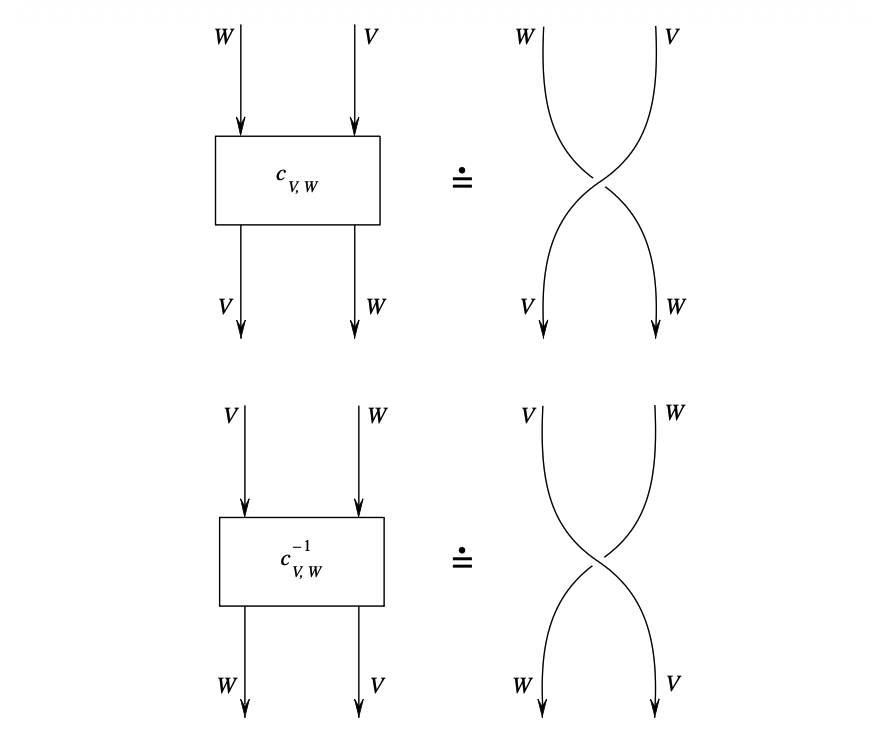 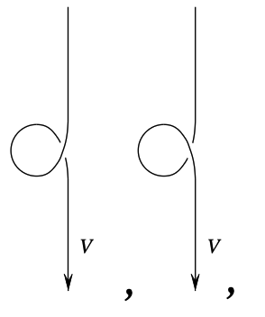

<figcaption>Crossing 对应 braiding；ribbon 的正负扭转对应 twist 及其逆。</figcaption>
</figure>

同痕变形的代数化，就是把"图可以连续拉动而不改变 isotopy class"翻译成范畴公理。比如，strand 穿过一个 tensor product 的两种画法相同，对应 braiding 的 hexagon identity $$c_{U,V\otimes W}
  =
  (\operatorname{id}_V\otimes c_{U,W})\circ(c_{U,V}\otimes\operatorname{id}_W).$$ 图形上，这正是把 $U$ 同时穿过 $V\otimes W$，或先穿过 $V$ 再穿过 $W$，所得图示同痕。

<figure data-latex-placement="H">
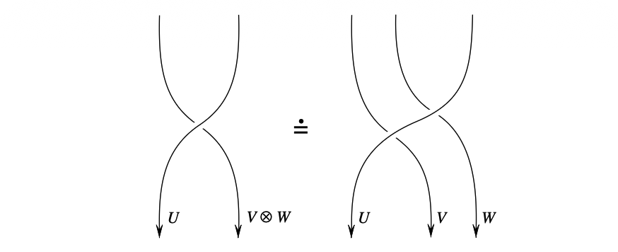
<figcaption>Braiding 的 hexagon identity 是 crossing 与 tensor product 相容性的图示版本。</figcaption>
</figure>

三条 strand 的 Reidemeister III 型同痕对应 Yang--Baxter identity： $$\begin{aligned}
  &(\operatorname{id}_W\otimes c_{U,V})\circ(c_{U,W}\otimes\operatorname{id}_V)\circ(\operatorname{id}_U\otimes c_{V,W})\\
  &\qquad =
  (c_{V,W}\otimes\operatorname{id}_U)\circ(\operatorname{id}_V\otimes c_{U,W})\circ(c_{U,V}\otimes\operatorname{id}_W).
\end{aligned}$$ 这解释了为什么一个 braiding 不只是任意的交换同构，而必须满足 braid relation。

<figure data-latex-placement="H">
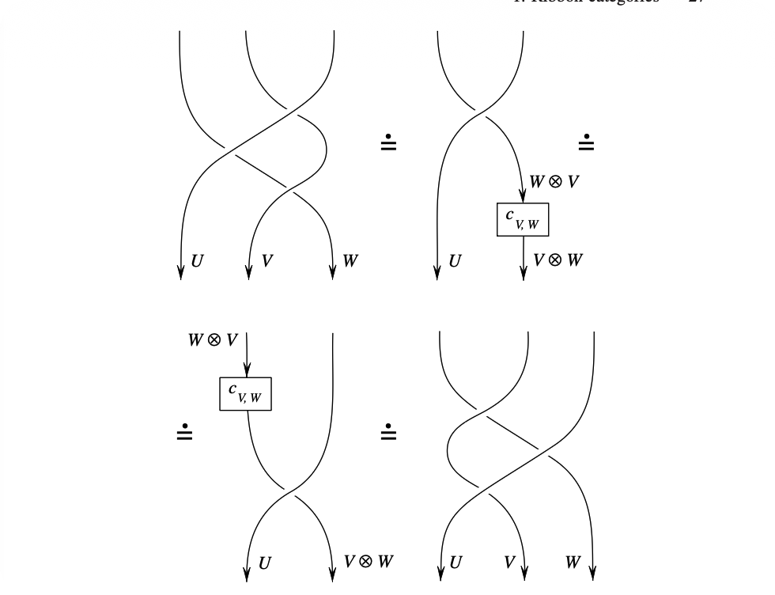
<figcaption>Yang–Baxter identity 是三条 colored strands 的 Reidemeister III 型同痕。</figcaption>
</figure>

类似地，morphisms 可以沿着 crossing 滑动，这对应 braiding 的自然性： $$(g\otimes f)\circ c_{V,W}
  =
  c_{V',W'}\circ(f\otimes g).$$ Cup 与 cap 的拉直则对应 duality 的 zig-zag identities： $$(\operatorname{id}_V\otimes d_V)\circ(b_V\otimes\operatorname{id}_V)=\operatorname{id}_V,\qquad
  (d_V\otimes\operatorname{id}_{V^*})\circ(\operatorname{id}_{V^*}\otimes b_V)=\operatorname{id}_{V^*}.$$

<figure data-latex-placement="H">

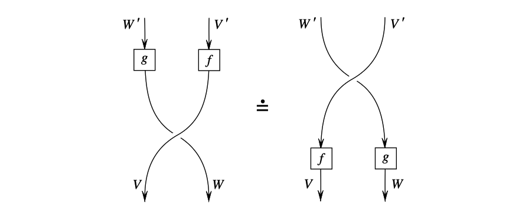 
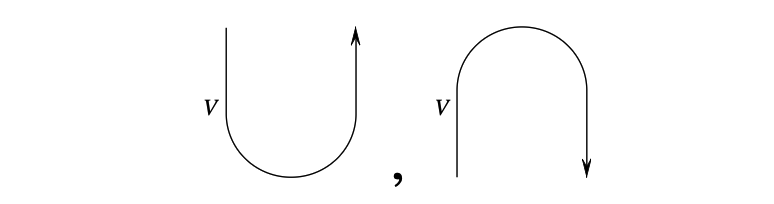 
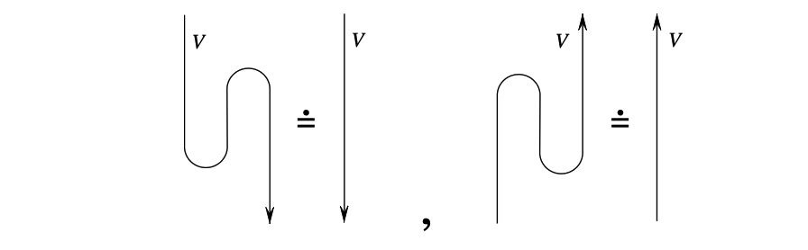

<figcaption>Naturality 允许 coupon 穿过 crossing；cup/cap 由 coevaluation/evaluation 给出，zig-zag identities 允许它们被拉直。</figcaption>
</figure>

最后，把这些局部规则拼起来，就可以解释带 coupons 的 ribbon graph。ribbon category 的公理正是保证这种翻译不依赖于图示切分方式，并且在 ribbon isotopy 下保持不变的代数条件。

<figure data-latex-placement="H">
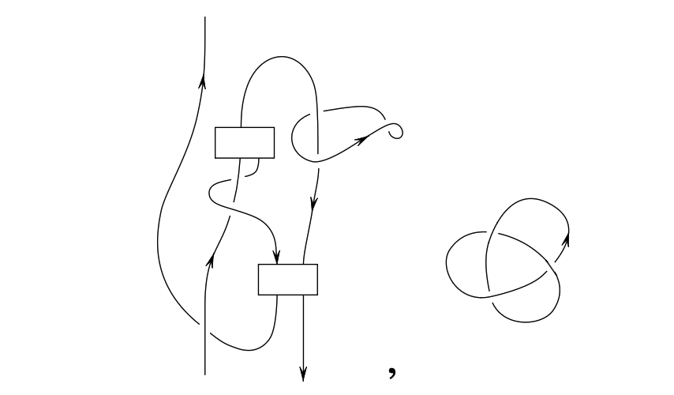
<figcaption>一般 ribbon graph 由 strands、crossings、twists、cups/caps 和 coupons 拼接而成。</figcaption>
</figure>

## Trace 与 dimension

ribbon category 中的 trace 是一个图形化的 trace，而不是一开始就给定的矩阵 trace。设 $f:V\to V$ 是 $\mathcal C$ 中的 endomorphism。记 $$b_V:\mathbf 1\to V\otimes V^*,\qquad
  d_V:V^*\otimes V\to \mathbf 1$$ 为 coevaluation 和 evaluation。Turaev 的 categorical trace 定义为 $$\operatorname{tr}_{\mathcal C}(f)
  =
  d_V\circ c_{V,V^*}\circ
  \bigl((\theta_V\circ f)\otimes \operatorname{id}_{V^*}\bigr)
  \circ b_V
  \in \operatorname{End}_{\mathcal C}(\mathbf 1).$$ 对象 $V$ 的 categorical dimension 定义为 $$\dim_{\mathcal C}(V)=\operatorname{tr}_{\mathcal C}(\operatorname{id}_V).$$ 图形上，$\operatorname{tr}_{\mathcal C}(f)$ 就是把一个标有 $f$ 的 coupon 放到一条 $V$-colored closed ribbon 上后得到的 closed ribbon graph invariant。也就是说，若 $\Omega_f$ 表示这个闭合图形，则 $$F(\Omega_f)=\operatorname{tr}_{\mathcal C}(f).$$

::: theorem
**定理 9** (Turaev ribbon graph functor). *对任意 ribbon category $\mathcal C$，存在一个拓扑不变量函子 $F$，它把 $\mathcal C$-colored ribbon graphs 映到 $\mathcal C$ 中的 morphisms。若 $\Gamma$ 是 closed colored ribbon graph，则 $$F(\Gamma)\in \operatorname{End}_{\mathcal C}(\mathbf 1).$$ 在 $\operatorname{End}_{\mathcal C}(\mathbf 1)=K$ 的情形下，$F(\Gamma)$ 是 $K$ 值不变量。*
:::

这个定理是 graphical calculus 的严格表述。它说明，只要范畴结构满足 ribbon category 的公理，局部图元的代数解释就自动对 Reidemeister 型局部变形不变。

# Hopf 代数如何产生 ribbon category

本节主线是：Hopf algebra $A$ 的每一层代数结构，恰好在表示范畴 $\mathrm{Rep}(A)$ 上诱导一层范畴结构，从而逐步把 $\mathrm{Rep}(A)$ 提升为 ribbon category（与拓扑侧的完整对照见第 [9](#sec:table){reference-type="ref" reference="sec:table"} 节）。

::: center
  **$A$ 上的结构**                  **$\mathrm{Rep}(A)$ 上的结构**   **图示**
  --------------------------------- -------------------------------- --------------
  bialgebra：$\Delta,\varepsilon$   monoidal（张量积、单位）         并列 strands
  Hopf：antipode $S$                rigid / duality                  cup、cap
  quasitriangular：$R$-matrix       braiding $c$                     crossing
  ribbon：universal twist $v$       twist $\theta$                   framing
:::

设 $A$ 是一个 Hopf algebra，结构映射为乘法、单位、coproduct $\Delta$、counit $\varepsilon$ 与 antipode $S$。若 $V$ 与 $W$ 是左 $A$-modules，则 $V\otimes W$ 上的 $A$-作用由 $\Delta$ 给出： $$a\cdot(v\otimes w)
  =\sum a_{(1)}v\otimes a_{(2)}w,
  \qquad
  \Delta(a)=\sum a_{(1)}\otimes a_{(2)}.$$ 因此 $\mathrm{Rep}(A)$ 是 monoidal category。

antipode 的作用是构造 dual modules。设 $V$ 是有限秩左 $A$-module，并记 $$V^*=\operatorname{Hom}_K(V,K).$$ 有两种自然的左 $A$-module 结构： $$(a\cdot f)(v)=f(S(a)v),$$ 以及 $$(a\cdot f)(v)=f(S^{-1}(a)v),$$ 其中第二个公式要求 $S$ 可逆。第一种结构使 evaluation $V^*\otimes V\to K$ 与 coevaluation $K\to V\otimes V^*$ 成为 $A$-linear maps；第二种结构则对应另一侧的 duality。换言之，antipode 是 cup 与 cap 可以被解释为 $A$-linear morphisms 的代数原因。

这里的 $A$-linearity 可以直接检查。把 $K$ 看成 counit 给出的平凡 $A$-module，即 $a\cdot c=\varepsilon(a)c$。令 $$d_V:V^*\otimes V\to K,\qquad d_V(f\otimes x)=f(x).$$ 则 $$\begin{aligned}
  d_V\bigl(a\cdot(f\otimes x)\bigr)
  &=\sum d_V(a_{(1)}f\otimes a_{(2)}x)\\
  &=\sum f\bigl(S(a_{(1)})a_{(2)}x\bigr)
   =\varepsilon(a)f(x),
\end{aligned}$$ 所以 $d_V$ 是 $A$-linear。若 $\{e_i\}$ 是 $V$ 的一组基，$\{e^i\}$ 是对偶基，则 $$b_V:K\to V\otimes V^*,\qquad
  b_V(1)=\delta_V=\sum_i e_i\otimes e^i$$ 也为 $A$-linear。事实上，将 $V\otimes V^*$ 识别为 $\operatorname{End}_K(V)$ 时，$\delta_V$ 对应 $\operatorname{id}_V$；而 $a$ 作用在 $\delta_V$ 上对应算子 $$z\longmapsto \sum_i e^i(S(a_{(2)})z)\,a_{(1)}e_i
  =\sum a_{(1)}S(a_{(2)})z
  =\varepsilon(a)z.$$ 因此 $a\cdot \delta_V=\varepsilon(a)\delta_V$，即 $b_V(a\cdot 1)=a\cdot b_V(1)$。

需要注意，有限维向量空间的标准映射 $$j_V:V\to V^{**},\qquad j_V(x)(f)=f(x)$$ 一般并不是 $A$-module isomorphism。事实上 $$(a\cdot j_V(x))(f)
  =j_V(x)(S(a)f)
  =f(S^2(a)x)
  =j_V(S^2(a)x)(f).$$ 因此 $j_V$ 只在 $S^2=\operatorname{id}$ 的特殊情形下自动是 $A$-linear。若 $A$ 是 ribbon Hopf algebra，则 Drinfeld element $u=m(S\otimes\operatorname{id})(R_{21})$ 与 universal twist $v$ 给出与 quantum trace 相容的 pivotal element $$g=uv,\qquad S^2(a)=gag^{-1}.$$ 这时真正的 $A$-module isomorphism $V\to V^{**}$ 是 $$p_V(x)(f)=f(gx)=j_V(gx)(f).$$ 因为 $$\begin{aligned}
  (a\cdot p_V(x))(f)
  &=p_V(x)(S(a)f)
    =f(S^2(a)gx)\\
  &=f(gax)
    =p_V(ax)(f).
\end{aligned}$$ 这也解释了为什么 quantum trace 中会出现同一个因子 $g=uv$。（有些文献把 $r=v^{-1}$ 称为 ribbon element，于是同一个因子写成 $ur^{-1}$；为避免来回切换，下文一律用 $v$。）

左对偶与右对偶的差别来自 evaluation/coevaluation 放在 $V$ 的哪一侧。在一般刚性 monoidal category 中，左对偶和右对偶不必相同；在 ribbon Hopf algebra 的表示范畴中，由于 ribbon 结构给出 compatible pivotal structure，左右对偶被系统地联系起来。这就是 framed oriented tangle 中方向反转与对偶颜色可以一致处理的原因。

::: definition
**定义 10** (quasitriangular Hopf algebra). *一个 quasitriangular Hopf algebra 是一个 Hopf algebra $A$，配有可逆元 $$R=\sum R^{(1)}\otimes R^{(2)}\in A\otimes A,$$ 称为 universal $R$-matrix，使得 $$R\Delta(a)R^{-1}=\Delta^{\operatorname{op}}(a),$$ 并且 $$(\Delta\otimes\operatorname{id})(R)=R_{13}R_{23},
  \qquad
  (\operatorname{id}\otimes\Delta)(R)=R_{13}R_{12}.$$ 这些恒等式保证 $R$ 与 coproduct 相容，并推出 Yang--Baxter equation。*
:::

若 $V,W$ 是 $A$-modules，则 $R$ 定义 braiding $$c_{V,W}
  =P\circ(\rho_V\otimes\rho_W)(R):V\otimes W\to W\otimes V,$$ 其中 $P$ 是交换两个张量因子的 flip。Yang--Baxter equation 正是 braid relations 的代数形式。因此 universal $R$-matrix 是 crossing 的代数来源。

::: definition
**定义 11** (ribbon Hopf algebra). *一个 ribbon Hopf algebra 是 quasitriangular Hopf algebra $(A,R)$，再配有 central invertible element $v\in A$，Turaev 称之为 universal twist，使它满足 $$\Delta(v)=R_{21}R(v\otimes v),\qquad
  S(v)=v,\qquad
  \varepsilon(v)=1,$$ 其中 $R_{21}=P_A(R)$ 是交换两个张量因子后的 $R$-matrix。如前所述，文献里也常把 $v^{-1}$ 称为 ribbon element，那时上面的 coproduct 公式会带一个 $(R_{21}R)^{-1}$ 因子。*
:::

::: proposition
**命题 12**. *若 $A$ 是 ribbon Hopf algebra，则有限维表示范畴 $\mathrm{Rep}_{\mathrm{fd}}(A)$ 是 ribbon category。其 braiding 由 universal $R$-matrix 给出，twist 则由 universal twist 的作用给出： $$\theta_V=\rho_V(v):V\to V.$$*
:::

这说明 Hopf algebra 并不是直接"描述 framed link"，而是通过其表示范畴给出 ribbon category，再由 Turaev 的 graphical calculus 得到 colored framed link invariant。

现在可以解释几种 trace 的关系。普通 trace $\operatorname{Tr}_V$ 是有限维向量空间 $V$ 上线性算子的矩阵 trace。quantum trace 则是先用 ribbon Hopf algebra 的 canonical element 把 ordinary trace 修正一下、再取 trace： $$\operatorname{tr}_q(f)
  =
  \operatorname{Tr}_V\!\left(\rho_V(uv)\circ f\right),$$ 其中 $u=m(S\otimes\operatorname{id})(R_{21})$ 是 Drinfeld element。于是 $$\dim_q(V)=\operatorname{tr}_q(\operatorname{id}_V)
  =
  \operatorname{Tr}_V(\rho_V(uv)).$$ 另一方面，上一节定义的 categorical trace $\operatorname{tr}_{\mathcal C}(f)$ 是图形闭合得到的 morphism $\mathbf 1\to\mathbf 1$。当 $\mathcal C=\mathrm{Rep}_{\mathrm{fd}}(A)$ 时，把 braiding、duality 和 twist 的具体公式代入 categorical trace，正好得到上面的 quantum trace： $$\operatorname{tr}_{\mathrm{Rep}(A)}(f)=\operatorname{tr}_q(f).$$ 因此三种写法并不矛盾：ordinary trace 是线性代数操作；quantum trace 是 Hopf algebra 表示里的 ordinary trace 加权版本；categorical trace 是同一个量的 coordinate-free 图形化定义。

# Colored framed link invariant

设 $A$ 是 ribbon Hopf algebra，令 $\mathcal C=\mathrm{Rep}_{\mathrm{fd}}(A)$。给定 oriented framed link $$L=L_1\cup\cdots\cup L_m,$$ 并给每个分量 $L_i$ 指定一个 color $V_i\in\mathcal C$，Turaev functor 给出标量 $$F(L;V_1,\ldots,V_m)\in\operatorname{End}_{\mathcal C}(\mathbf 1).$$ 若 $\operatorname{End}_{\mathcal C}(\mathbf 1)=K$，则这就是 $K$ 值的 colored framed link invariant。

这里必须强调"framed"。在 ribbon category 中，正负 twist 分别由 $\theta_V$ 及其逆表示；因此 link component 的 framing 改变会改变 invariant。若采用 blackboard framing，则 diagram 的 writhe 可以用来编码 framing；这正是 framed link 与 ribbon diagram 对应的图示基础。

# 从 link invariant 到三维流形不变量 {#sec:surgery}

上一节得到的 $F(L;V_1,\ldots,V_m)$ 只是 colored framed link invariant。要由它定义 $M_L$ 的不变量，必须消除 surgery presentation 的非唯一性。按照 Kirby 定理，需要构造一个表达式 $\tau(L)$，使其在 handle slides 与 $\pm 1$ moves 下不变。

实现这一点的结构是 modular category。下文把它写成 $$(\mathcal V,\{V_i\}_{i\in I}),$$ 其 ground ring 为 $K$。

::: definition
**定义 13** (modular category). *一个 modular category 是一个 ribbon $K$-linear category $\mathcal V$，连同有限个 simple objects 的代表集 $\{V_i\}_{i\in I}$，满足以下条件：*

1.  *单位对象属于这组 simples，即存在 $0\in I$ 使得 $V_0=\mathbf 1$；*

2.  *对偶封闭：对每个 $i\in I$，存在 $i^*\in I$ 使得 $V_{i^*}\cong V_i^*$；*

3.  *domination：每个对象 $X$ 的 identity morphism 都可写成有限和 $$\operatorname{id}_X=\sum_r f_r g_r,$$ 其中 $g_r:X\to V_{i(r)}$，$f_r:V_{i(r)}\to X$，且 $i(r)\in I$；*

4.  *Hopf link matrix $$S_{ij}=\operatorname{tr}(c_{V_j,V_i}\circ c_{V_i,V_j})$$ 在 $K$ 上可逆。*
:::

前三条条件表达"有限 simple colors 足够控制整个范畴"；最后一条 non-degeneracy 条件是 modularity 的核心，它使 Kirby color 具有 handle-slide 不变性。记 $$\dim(i)=\dim(V_i),\qquad
  S_{ij}=\operatorname{tr}(c_{V_j,V_i}\circ c_{V_i,V_j}),$$ 其中 $S_{ij}$ 是 Hopf link matrix。若 twist 在 simple object $V_i$ 上的标量为 $v_i$，则 Turaev 还引入 $$D^2=\sum_{i\in I}\dim(i)^2,\qquad
  \Delta=\sum_{i\in I}v_i^{-1}\dim(i)^2.$$ 这里 $D$ 称为 rank；$\Delta$ 是由 twist anomaly 决定的常数。

::: definition
**定义 14** (Kirby color). *Kirby color 是形式线性组合 $$\Omega_{\mathcal V}=\sum_{i\in I}\dim(i)V_i.$$ 若 $L$ 有 $m$ 个分量，把每个分量都染成 $\Omega_{\mathcal V}$，意思是取 Turaev 的加权求和 $$\{L\}
  =
  \sum_{\lambda\in\operatorname{col}(L)}
  \left(\prod_{n=1}^m \dim(\lambda(L_n))\right)
  F(\Gamma(L,\lambda)).$$ 这里 $\operatorname{col}(L)$ 是从 $L$ 的分量集合到 $I$ 的所有 coloring，$\Gamma(L,\lambda)$ 是对应的 colored ribbon graph。$\Omega_{\mathcal V}$ 不是范畴中的普通对象，而是 surgery coloring sum 的记号。*
:::

Kirby color 的核心性质是 handle-slide property：一个 strand 在 $\Omega_{\mathcal V}$-colored component 上滑过，不改变整体加权求和。这一性质的代数来源可以理解为 Hopf link $S$-matrix 的非退化性和 quantum dimensions 的配合；几何上，它正是 Kirby handle slide 的不变性。

设 $B_L$ 是 framed link $L$ 的 linking matrix。对角元为 framing，非对角元为 pairwise linking numbers。记 $$\sigma(L)=\sigma_+(L)-\sigma_-(L)$$ 为 $B_L$ 的 signature；等价地，它是 Turaev 的四维 $W_L$ 的 intersection form signature。Kirby 的 $\pm 1$ move 会改变 signature，因此 $\{L\}$ 本身通常不是三维流形不变量。

T94 Chapter II 的归一化公式是 $$\tau_{\mathcal V,D}(M_L)
  =
  \Delta^{\sigma(L)}
  D^{-\sigma(L)-m-1}
  \{L\}.$$ 这里 $m$ 是 surgery link 的分量数。该公式的 normalization 给出 $\tau_{\mathcal V,D}(S^3)=D^{-1}$ 和 $\tau_{\mathcal V,D}(S^1\times S^2)=1$。不同文献可能把 $D$ 或 $\Delta$ 吸收到整体常数中；关键结构事实不变：Kirby color 保证 handle slide 不变性，$\Delta$ 与 signature/rank normalization 保证 $\pm 1$ move 不变性。

::: theorem
**定理 15** (Reshetikhin--Turaev invariant). *设 $(\mathcal V,\{V_i\}_{i\in I})$ 是 modular category，并选定 rank $D$。由 Kirby color 加权求和和 signature 归一化得到的数量 $\tau_{\mathcal V,D}(M_L)$ 在 Kirby moves 下不变。因此它只依赖于 closed oriented $3$-manifold $M_L$ 的 orientation-preserving homeomorphism class，给出三维流形不变量 $$\tau_{\mathcal V,D}(M)\in K.$$ 更一般地，若 closed $3$-manifold $M$ 中含有 $\mathcal V$-colored framed ribbon graph $\Gamma$，同样可以定义 pair invariant $\tau_{\mathcal V,D}(M,\Gamma)$。*
:::

# Modular Hopf algebra 与 purification

T94 Chapter XI 先在 Hopf 代数层面定义 modular Hopf algebra，再通过表示范畴与 purification 得到 modular category。本节记录这一步的具体形式。

::: definition
**定义 16** (negligible module). *设 $A$ 是 ribbon Hopf algebra，$Z$ 是有限秩 $A$-module。若对任意 $A$-linear endomorphism $f:Z\to Z$ 都有 $$\operatorname{tr}_q(f)=0,$$ 则称 $Z$ 是 negligible module。等价地，$\operatorname{id}_Z$ 的 quantum trace 为零，并且经过 $Z$ 的 morphisms 在 purification 中会被商掉。*
:::

::: definition
**定义 17** (modular Hopf algebra). *一个 modular Hopf algebra 是一个 ribbon Hopf $K$-algebra $A$，连同一族有限秩 simple $A$-modules $\{V_i\}_{i\in I}$，满足：*

1.  *存在 $0\in I$，使 $V_0=K$，其中 $A$ 通过 counit 作用在 $K$ 上；*

2.  *对每个 $i\in I$，存在 $i^*\in I$，使 $V_{i^*}\cong V_i^*$；*

3.  *对任意 $k,l\in I$，张量积 $V_k\otimes V_l$ 可分解为有限个 $V_i$ 的直和，加上一个 negligible $A$-module；*

4.  *由 monodromy $R_{21}R$ 给出的 Hopf link matrix $$S_{ij}=\operatorname{tr}_q\!\left((R_{21}R)|_{V_i\otimes V_j}\right)$$ 在 $K$ 上可逆。*
:::

这个定义是 modular category 公理在 Hopf algebra 表示论中的对应版本。单位对象、对偶闭合和 tensor product 分解对应 modular category 的前三条公理；$S$-matrix 可逆对应 non-degeneracy。区别是：在 quantum group at roots of unity 中确实会出现 negligible modules，因此 $\mathrm{Rep}(A)$ 的相应子范畴一般首先是 quasimodular category，而不是已经纯粹的 modular category。

::: theorem
**定理 18** (Turaev). *设 $(A,\{V_i\})$ 是 modular Hopf algebra。由 $\{V_i\}$ quasidominate 的 $A$-modules 构成 $\mathrm{Rep}(A)$ 的一个 ribbon 子范畴 $\mathcal T$。则 $(\mathcal T,\{V_i\})$ 是 quasimodular category。将 $\mathcal T$ 按 negligible morphisms 取 quotient，即 purification，得到 modular category $\mathcal T_p$。于是每个 modular Hopf algebra canonically gives rise to a modular category。*
:::

因此，在 T94 的层级中，modular Hopf algebra 是产生 quasimodular category 的 Hopf-algebraic input；purification 是从这个 quasimodular category 到 modular category 的一步： $$\begin{aligned}
  \text{modular Hopf algebra}
  &\longrightarrow \text{quasimodular category}\\
  &\longrightarrow \text{purified modular category}\\
  &\longrightarrow \text{RT invariant}.
\end{aligned}$$

# $U_q(\mathfrak{sl}_2)$、Jones polynomial 与 WRT invariant

最后说明本文主线如何包含 Jones polynomial。这里要区分 generic parameter 与 root of unity 两种情形。T94 Chapter XI §7.5 讨论的是 generic 或 $h$-adic 情形：由 $U_h\mathfrak g$ 的 regular finite-rank modules 组成 ribbon category。一个 indecomposable regular module 由最高权标号，而这些最高权等价于 $m=\operatorname{rank}\mathfrak g$ 个非负整数。因此，若 $$L=L_1\cup\cdots\cup L_s$$ 是 framed oriented link，给每个分量指定一个最高权 $$L_j\longmapsto V_{\lambda_j}$$ 就得到一个 colored framed link。把这个 colored link 代入 Chapter I 的 operator invariant $F$，得到 $$F(L;V_{\lambda_1},\ldots,V_{\lambda_s})\in \mathbb C[[h]].$$ T94 §7.5 指出，这个不变量实际上是变量 $$q=\exp(-h/2)$$ 的 Laurent polynomial。

当 $\mathfrak g=\mathfrak{sl}_2(\mathbb C)$ 时，rank 为 $1$，indecomposable regular modules 由一个非负整数标号： $$V_0,V_1,V_2,\ldots .$$ 这里 $V_n$ 是最高权为 $n$ 的表示，经典维数为 $n+1$。因此，对 knot $K$，每个 $n\ge 0$ 都给出一个 framed colored link polynomial $$F(K;V_n).$$ 这些就是 colored Jones polynomial 的 quantum-group 来源。特别地，$V_1$ 是二维基本表示；T94 §7.5 说明，当 link 的所有分量都染成 $\mathfrak{sl}_2$ 的基本表示时，得到的 $F$ 是 Jones polynomial 的一个版本。对 $n>1$，得到的是 higher colored Jones polynomials。

还需注意，operator invariant $F$ 首先是 framed link invariant。若从一个普通 oriented link diagram $D$ 出发，通常先采用 blackboard framing，把 $D$ 看成 framed link diagram，再给每个分量染成 $V_1$，计算 $$F(D;V_1,\ldots,V_1).$$ 这个量在 Reidemeister II、III 型变形下表现良好，但 Reidemeister I 会改变 blackboard framing。要得到普通 oriented link invariant，需要用 diagram 的 writhe 做归一化，抵消 twist eigenvalue 带来的 framing dependence。换言之， $$\text{Jones polynomial}
  =
  \text{writhe-normalized }F(D;V_1,\ldots,V_1),$$ 其中变量替换和整体常数依 convention 而不同。T94 Chapter XII 从 Kauffman bracket viewpoint 给出同一现象：bracket 是 framed link invariant，乘以 writhe 修正因子后得到 ordinary oriented Jones polynomial。

在 root of unity 情形，需要把允许的 colors 截断到有限的 Weyl alcove simple modules。T94 说明，对于满足相应阶数条件的 $q$，可以从 $U_q(\mathfrak g)$ 得到 modular Hopf algebra；经过 purification 得到 modular category 后，再应用第 [6](#sec:surgery){reference-type="ref" reference="sec:surgery"} 节所总结的 surgery construction，就得到 Witten--Reshetikhin--Turaev 型 $3$-manifold invariants。

因此，三者的逻辑关系是：

1.  generic/h-adic 的 $U_q(\mathfrak{sl}_2)$ 给出 colored Jones polynomials；

2.  颜色 $V_1$，也就是二维基本表示，给出 ordinary Jones polynomial 的一个归一化版本；

3.  root of unity 下的有限 modular data 经过 surgery/Kirby normalization 给出 WRT $3$-manifold invariants。

# 结构表 {#sec:table}

  **Hopf 代数结构**              **代数数据**                                                                           **表示范畴中的结构**                                        **拓扑解释**
  ------------------------------ -------------------------------------------------------------------------------------- ----------------------------------------------------------- --------------------------------------------------------
  algebra                        multiplication, unit                                                                   $A$-modules 与 $A$-linear maps                              只有表示论，还不能自然解释并列 strands
  bialgebra                      coproduct, counit                                                                      monoidal category                                           解释 tensor product，即多条线并列
  Hopf algebra                   antipode                                                                               rigid category / duality                                    解释 cup、cap、orientation reversal
  quasitriangular Hopf algebra   universal $R$-matrix                                                                   braided category                                            解释 crossing
  ribbon Hopf algebra            universal twist                                                                        ribbon category                                             解释 twist 与 framing
  modular Hopf algebra           finite simple colors, quantum dimensions, invertible $S$-matrix, negligible summands   quasimodular category；purification 后为 modular category   通过 Kirby color 与 signature 归一化得到三维流形不变量

  : 从 Hopf 代数结构到拓扑构造的对应关系

# 参考文献

1. N. Reshetikhin and V. Turaev, *Ribbon graphs and their invariants derived from quantum groups*, Communications in Mathematical Physics 127 (1990), 1--26.
2. N. Reshetikhin and V. Turaev, *Invariants of 3-manifolds via link polynomials and quantum groups*, Inventiones Mathematicae 103 (1991), 547--597.
3. V. G. Turaev, *Quantum Invariants of Knots and 3-Manifolds*, de Gruyter, 1994.
4. R. Kirby, *A calculus of framed links in $S^3$*, Inventiones Mathematicae 45 (1978), 35--56.

