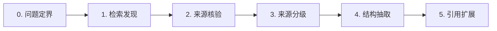

::: {.callout-note}
📚 本文档整理数学地图项目（math-map）文献检索流程中使用的 4 个 API 工具：arXiv、Crossref、OpenAlex、zbMATH。覆盖论文搜索、DOI 核验、引用扩展、数学专用检索等环节，配合「动作分解」流水线的第 0–5 步使用。所有工具均为 REST API，免费开放（zbMATH 需申请 token）。
:::

# 检索流程与工具对照



| 步骤 | 工具 | 用途 | 认证 |
|-|-|-|-|
| 检索发现 | arXiv API | 搜索预印本、获取元数据 | 无需 |
| 检索发现 | Crossref API | 按关键词/DOI 查已发表论文 | 无需（建议传邮箱） |
| 检索发现 | OpenAlex API | 按概念/作者/机构搜索 | 无需 |
| 检索发现 | zbMATH Open | 数学专用：按 MSC/Zbl 检索 | 需申请 token |
| 来源核验 | Crossref API | DOI → 元数据核对 | 无需 |
| 来源核验 | arXiv API | arXiv ID → 元数据核对 | 无需 |
| 来源核验 | zbMATH Open | Zbl ID → 书目信息 | 需 token |
| 引用扩展 | OpenAlex API | cited_by / references 列表 | 无需 |

# arXiv API — 论文搜索与核验

arXiv 是数学/物理/CS 预印本平台，API 免开放，无需认证。适合检索最新研究、获取论文元数据。

## 搜索论文

```bash
curl "http://export.arxiv.org/api/query?search_query=all:quantum+groups&start=0&max_results=5"
```

返回 Atom XML，每条含 title、authors、summary、id（arXiv ID）、published、updated。

| 参数 | 说明 | 示例 |
|-|-|-|
| search_query | 搜索表达式，支持字段限定 | ti:quantum+groups（标题）  <br/>au:Lusztig（作者） |
| start | 偏移量 | 0 |
| max_results | 返回数量（上限 30000） | 5 |
| sortBy | 排序：relevance / lastUpdatedDate / submittedDate | relevance |
| sortOrder | ascending / descending | descending |

## 按 arXiv ID 获取元数据（核验用）

```bash
curl "http://export.arxiv.org/api/query?id_list=2106.05252"
```

返回该论文的完整元数据：标题、作者列表、摘要、版本历史、DOI（如有）。用于核验 SOURCES.md 中的 @key 条目。

::: {.callout-tip}
💡 **math-map 用法**：发现候选论文后，用 id_list 查 arXiv API 取回标题/作者/日期，与人工记忆或搜索结果交叉核对。一致则写入 SOURCES.md 的核验字段。
:::

# Crossref API — DOI 核验

Crossref 是 DOI 注册机构的联合数据库，收录已发表论文、书籍、会议录的元数据。是 DOI 核验的权威来源。

::: {.callout-important}
❗ 建议在请求中传入 `mailto=your@email.com`，可进入「polite pool」，速率更高、响应更快。
:::

## 按 DOI 查询元数据（核验核心）

```bash
curl "https://api.crossref.org/works/10.1007/978-1-4612-0783-2?mailto=you@example.com"
```

返回 JSON，关键字段：title、author（含 given/family）、container-title（期刊/书名）、published-print.date-parts、publisher、ISBN、DOI、type、is-referenced-by-count（被引次数）。

## 按关键词搜索

```bash
curl "https://api.crossref.org/works?query=quantum+groups+Lusztig&rows=5&mailto=you@example.com"
```

| 参数 | 说明 | 示例 |
|-|-|-|
| query | 自由关键词 | quantum groups categorification |
| rows | 返回数量（默认 20，上限 1000） | 10 |
| filter | 字段过滤 | from-pub-date:2020（年份）  <br/>type:book（类型） |
| sort | 排序：relevance / is-referenced-by-count | is-referenced-by-count |
| mailto | 邮箱（进入 polite pool） | you@example.com |

## 常见 filter 参数

- `from-pub-date:YYYY` / `until-pub-date:YYYY` — 年份范围
- `type:book` / `type:journal-article` / `type:proceedings-article` — 文献类型
- `member:` — 出版商 ID（如 Springer = 297）

::: {.callout-tip}
💡 **math-map 用法**：拿到候选 DOI 后，查 Crossref works 端点核对 title / author / year / publisher 四字段。全部一致 → 核验通过，写入"核验: Crossref DOI + 取回日期"。字段冲突 → 标"存疑"，不得自动调和。
:::

# OpenAlex API — 引用扩展与影响力

OpenAlex 是开放的学术知识图谱，收录 2.5 亿+ 学术作品，含引用关系、概念标签、机构信息。免费开放，无需 API key（可选传邮箱提升速率）。

## 按 OpenAlex Work ID 查询

```bash
curl "https://api.openalex.org/works/W2741809807?mailto=you@example.com"
```

## 按 DOI 查询（推荐核验入口）

```bash
curl "https://api.openalex.org/works/doi:10.1007/978-1-4612-0783-2?mailto=you@example.com"
```

返回 JSON，关键字段：title、authorships（含 author.display_name + institutions）、publication_year、primary_location（期刊/出版社）、cited_by_count、referenced_works（引用了谁）、cited_by_api_url（被谁引用）、concepts（学科标签）。

## 关键词搜索

```bash
curl "https://api.openalex.org/works?filter=default.search:quantum%20groups,cited_by_count:%3E50&sort=cited_by_count:desc&per_page=10&mailto=you@example.com"
```

| 参数 | 说明 | 示例 |
|-|-|-|
| default.search | 全文搜索 | quantum groups |
| filter | 字段过滤（见下表） | publication_year:2020 |
| sort | 排序 | cited_by_count:desc |
| per_page | 每页数量（默认 25，上限 200） | 10 |
| select | 只返回指定字段 | id,title,cited_by_count |

## 常用 filter 参数

- `publication_year:2020` — 发表年份
- `cited_by_count:>100` — 被引次数下限
- `concepts.id:C4513` — OpenAlex 概念 ID
- `authorships.author.display_name:Lusztig` — 按作者名

## 引用扩展：获取引用/被引列表

```bash
curl "https://api.openalex.org/works?filter=cites:W2741809807&sort=cited_by_count:desc&per_page=10&mailto=you@example.com"
```

    # referenced_works 字段直接返回引用的 work ID 列表
    # 也可用 filter=cited_by:WID 查被谁引用

::: {.callout-tip}
💡 **math-map 用法**：OpenAlex 是引用扩展的主力工具。拿到种子来源的 work ID 后，查 referenced_works（向前）和 cited_by（向后），用 concepts 过滤离题论文，按 cited_by_count 排序找枢纽节点。引用关系 ≠ 逻辑依赖，需二次判断。
:::

# zbMATH Open — 数学专用检索

zbMATH Open 是数学专用文献数据库，收录 400 万+ 数学文献，含 MSC 分类、Zbl 编号、评论。适合查无 DOI 的经典文献、获取权威书目信息。

::: {.callout-important}
❗ zbMATH Open API 需要访问 token。免费申请：[https://zbmath.org/api/](https://zbmath.org/api/)，注册后即可获得。
:::

## 按 Zbl ID 查询（核验经典文献）

```bash
curl "https://api.zbmath.org/v1/documents/_search?zbmath_id=0788.17010" \
  -H "Accept: application/json"
```

返回 JSON，关键字段：title、authors、year、source（期刊/出版社）、msc（MSC 分类代码）、doi、review（zbMATH 评论摘要）。

## 按关键词搜索

```bash
curl "https://api.zbmath.org/v1/documents/_search?search_request=quantum+groups+Lusztig" \
  -H "Accept: application/json"
```

| 参数 | 说明 | 示例 |
|-|-|-|
| zbmath_id | Zbl 编号（精确查询） | 0788.17010 |
| search_request | 关键词 | categorification quantum |
| page | 页码 | 1 |
| results_per_page | 每页数量 | 10 |

## MSC 分类过滤

zbMATH 的独特优势是 MSC（Mathematics Subject Classification）分类。搜索时可加 MSC 限定：

- `17Bxx` — Lie algebras（量子群相关）
- `16Txx` — Hopf algebras
- `81Rxx` — Quantum mechanics / quantum field theory
- `57Mxx` — Low-dimensional topology（纽结不变量）

::: {.callout-tip}
💡 **math-map 用法**：zbMATH 用于核验无 DOI 的经典文献（如 1980–90s 的 Springer/Birkhäuser 旧书）。拿到 Zbl ID 后查 zbMATH 确认 title/author/year/publisher。MSC 分类可用于判断一个来源是否属于数学主干还是外部应用分支。
:::

# 组合使用示例

## 完整核验流程示例

以 Kassel《Quantum Groups》(1995) 为例，演示从发现到核验的全流程：

:::{.grid}
:::{.g-col-12 .g-col-md-6}
**Step 1: 发现候选**
已知书名和作者，不确定 DOI。
```bash
# 用 Crossref 搜索
curl "https://api.crossref.org/works?query=Quantum+Groups+Kassel&rows=3"

# 返回 DOI: 10.1007/978-1-4612-0783-2
```
:::
:::{.g-col-12 .g-col-md-6}
**Step 2: DOI 核验**
用 DOI 查 Crossref 确认元数据。
```bash
curl "https://api.crossref.org/works/10.1007/978-1-4612-0783-2"

# 确认: title="Quantum Groups"
# author="Christian Kassel"
# publisher="Springer New York"
# year=1995
```
:::
:::

:::{.grid}
:::{.g-col-12 .g-col-md-6}
**Step 3: zbMATH 旁证**
```bash
# 用 Zbl ID 查 zbMATH
curl "https://api.zbmath.org/v1/documents/_search?zbmath_id=0667.16003"

# 确认同一本书，MSC: 17B37
```
:::
:::{.g-col-12 .g-col-md-6}
**Step 4: OpenAlex 被引**
```bash
curl "https://api.openalex.org/works/doi:10.1007/978-1-4612-0783-2"

# cited_by_count: 1115
# 确认高影响力，角色: 承重
```
:::
:::

**最终写入 SOURCES.md：**

```markdown
### @kassel1995
- 标题: Quantum Groups
- 作者: Christian Kassel
- 出版: Springer New York, 1995
- 类型: 教材
- 角色: 承重
- 链接: https://doi.org/10.1007/978-1-4612-0783-2
- 核验: Crossref API + zbMATH Zbl 0667.16003 + OpenAlex cited_by=1115
```

---

## 引用扩展示例

以 Khovanov-Lauda 2009 范畴化论文为种子，向前扩展：

```bash
# 先拿到 OpenAlex work ID
curl "https://api.openalex.org/works/doi:10.1007/s00031-009-9036-x"
# 返回 ID: W2043292457

# 查谁引用了它
curl "https://api.openalex.org/works?filter=cites:W2043292457&sort=cited_by_count:desc&per_page=10"

# 用 concepts 过滤数学主干
curl "https://api.openalex.org/works?filter=cites:W2043292457,concepts.id:C339234547&per_page=10"
```

::: {.callout-tip}
💡 引用关系 ≠ 逻辑依赖。高被引的论文可能是外部应用（物理、工程），不代表它在数学主干上。必须结合教材/综述的目录结构做二次判断。
:::

# 常见问题

:::{.grid}
:::{.g-col-12 .g-col-md-6}
**Q: Crossref 和 OpenAlex 有什么区别？**
Crossref 是 DOI 注册机构，元数据权威但不含引用关系。OpenAlex 是学术知识图谱，含完整引用网络和概念标签。核验用 Crossref，引用扩展用 OpenAlex。
:::
:::{.g-col-12 .g-col-md-6}
**Q: 没有 DOI 的旧书怎么核验？**
用 zbMATH 的 Zbl ID 核验。1980–90s 的 Springer/Birkhäuser 数学书通常在 zbMATH 有记录。查不到的降级为"存疑"。
:::
:::

:::{.grid}
:::{.g-col-12 .g-col-md-6}
**Q: API 有速率限制吗？**

- **arXiv**：无官方限制，但建议间隔 3 秒
- **Crossref**：polite pool 50 req/s，普通 1 req/s
- **OpenAlex**：polite pool 100K req/day，普通 10K
- **zbMATH**：需 token，限制见官方文档
:::
:::{.g-col-12 .g-col-md-6}
**Q: 可以用 Python 代替 curl 吗？**
可以。所有 API 都是 REST + JSON，用 `requests` 库即可。后续 math-map 计划封装为独立的 `source_discovery` 模块。
:::
:::

::: {.callout-note}
✅ **参考链接**

- arXiv API：[https://info.arxiv.org/help/api/](https://info.arxiv.org/help/api/)
- Crossref API：[https://api.crossref.org/swagger-ui/index.html](https://api.crossref.org/swagger-ui/index.html)
- OpenAlex API：[https://docs.openalex.org/](https://docs.openalex.org/)
- zbMATH Open：[https://api.zbmath.org/](https://api.zbmath.org/)
:::