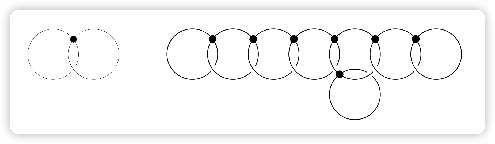

::: {.callout-note appearance="minimal"}
**作者**：约翰·米尔诺（John Milnor）

**原文**：*Differential Topology Forty-six Years Later*, Notices of the AMS, Vol. 58, No. 6, 2011
:::

1965年的赫德里克讲座（Hedrick Lectures）^[该讲座近期已由数学科学研究所（MSRI）数字化，即将公开。]中，我描述了微分拓扑学的发展状况——这一领域当时尚属新兴，却发展极为迅速。此后数十年间，许多曾被认为完全无法解决的微分拓扑与几何拓扑问题相继得到解答，而解决这些问题往往依赖于全新的方法。以下将简要概述这些进展中的部分亮点。

## 主要进展

首个重大突破由柯比（Kirby）与西本曼（Siebenmann）[1969, 1969a, 1977] 取得，他们为"将给定拓扑流形三角剖分为分片线性流形（PL流形）"这一问题建立了障碍理论。

设 $B_{\mathrm{Top}}$ 与 $B_{\mathrm{PL}}$ 为讲座中所述的稳定分类空间，他们证明：当 $j=4$ 时，相对同伦群 $\pi_{j}(B_{\mathrm{Top}}, B_{\mathrm{PL}})$ 是2阶循环群，而在其他情况下均为零群。

对于 $n$ 维拓扑流形 $M^n$，由此可推出存在一个障碍类 $o \in H^4(M^n ; \mathbb{Z}/2)$，其决定了 $M^n$ 能否被三角剖分为PL流形。当维数 $n \geq 5$ 时，这是唯一的障碍。若存在这样的三角剖分，则在 $H^3(M^n ; \mathbb{Z}/2)$ 中存在另一个类似的障碍类，其决定了该三角剖分在"拓扑同痕于恒等映射的PL同构"意义下的唯一性。

::: {.callout-tip icon=false}
## 定理 1
若无边拓扑流形 $M^n$ 满足 $H^3(M^n ; \mathbb{Z}/2)=H^4(M^n ; \mathbb{Z}/2)=0$ 且 $n>5$，则 $M^n$ 存在唯一的PL流形结构（在PL同构意义下）。
:::

（对于带边流形，需满足$n>5$。）莫伊泽（Moise）[1952] 更早便证明了所有维数$n \leq 3$的流形对应的上述定理。然而，我们将看到维数4时的对应结论并不成立。

此前，芒克雷斯（Munkres）[1960, 1964a, 1964b] 与赫希（Hirsch）[1963] 已为“从PL结构过渡到光滑结构”的问题建立了类似的障碍理论（另见[赫希-马祖尔（Hirsch-Mazur）, 1974]）。此外，塞尔夫（Cerf）通过复杂的几何论证填补了关键空白，证明了三维球面的保向微分同胚空间是连通的（参见1962/63年嘉当讨论班讲义及[塞尔夫, 1968]）。结合其他已知结果，这导出了如下定理：

::: {.callout-tip icon=false}
## 定理 2
所有维数$n \leq 7$的PL流形均存在相容的光滑结构；且当$n<7$时，该光滑结构在微分同胚意义下是唯一的。
:::

更多细节参见本文末尾的“补充说明”。

下一个重大突破是弗里德曼（Freedman）[1982] 对单连通闭4维拓扑流形的分类。他运用高度非可微的方法证明：此类流形由以下两项唯一确定：
1. 对称双线性形式$H^2 \otimes H^2 \to H^4 \cong \mathbb{Z}$的同构类（其中$H^k=H^k(M^4 ; \mathbb{Z})$）；
2. 柯比-西本曼不变量
$$o \in H^4\left(M^4 ; \mathbb{Z}/2\right) \cong \mathbb{Z}/2.$$

这两项可任意指定，但需满足两个限制条件：双线性形式的行列式必须为$\pm 1$；且在“偶情形”（即对所有$x \in H^2$，$x \cup x \equiv 0$（模$2H^4$））下，柯比-西本曼类必须同余于符号差的1/8。例如，4维拓扑流形的庞加莱猜想便是其直接推论：若$M^4$是同伦球面，则$H^2$与障碍类均为零，故$M^4$同胚于标准4维球面。

一年后，唐纳森（Donaldson）[1983] 运用规范理论方法证明：上述许多拓扑流形并不存在任何光滑结构（因此由定理2可知，它们无法被三角剖分为PL流形）。更具体地，若$M^4$是光滑、单连通且具有正定双线性形式的4维流形，则该双线性形式必可对角化，因此$M^4$必同胚于若干个复射影平面的连通和。存在许多行列式为1、偶情形下符号差可被16整除但不可对角化的正定双线性形式（例如参见[米尔诺-胡塞尔莫勒（Milnor-Husemoller）, 1973]）。每一个这样的双线性形式都对应一个不存在光滑结构的拓扑流形$M^4$，但$M^4 \times \mathbb{R}$却存在唯一的光滑结构（在微分同胚意义下）。

弗里德曼的拓扑结果与唐纳森的分析结果相结合，迅速产生了令人惊叹的推论。例如，$\mathbb{R}^4$上存在不可数多个互不微分同胚的光滑结构（参见[冈普夫（Gompf）, 1993]）。其他维数的情况则更为良好：对于$n>4$，斯托林斯（Stallings）[1962] 证明拓扑空间$\mathbb{R}^n$的PL结构在PL同构意义下是唯一的；结合莫伊泽关于$n<4$的结果及芒克雷斯-赫希-马祖尔障碍理论，可推出对所有$n \neq 4$，$\mathbb{R}^n$的光滑结构在微分同胚意义下是唯一的。

3维流形的完善理论则发展得更为缓慢。首个里程碑是瑟斯顿（Thurston）[1982, 1986] 提出的几何化猜想，该猜想为3维流形理论设定了目标。这一猜想最终由佩雷尔曼（Perelman）[2002, 2003a, 2003b] 利用基于“里奇流”偏微分方程的复杂论证得以证实（参见摩根-田刚（Morgan-Tian）[2007] 及克莱纳-洛特（Kleiner-Lott）[2008] 的阐述）。3维庞加莱猜想作为其特殊情形随之得证。

### 庞加莱猜想的三种版本
首先考虑纯拓扑版本：

::: {.callout-tip icon=false}
## 定理 3（拓扑庞加莱猜想）
拓扑庞加莱猜想在所有维数下均成立。
:::

即每个与$n$维球面同伦等价的闭拓扑流形，实际上都与$n$维球面同胚。对于$n>4$，纽曼（Newman）[1966] 与康奈尔（Connell）[1967] 利用斯托林斯[1960] 的"吞噬法"证明了该结论；对于$n=4$，其证明当然归功于弗里德曼；对于$n=3$，佩雷尔曼通过莫伊泽[1952] 的结果将拓扑情形转化为PL情形，再利用芒克雷斯-赫希-马祖尔障碍理论将PL情形转化为光滑情形，从而完成了证明。□

::: {.callout-tip icon=false}
## 定理 4（PL庞加莱猜想）
分片线性庞加莱猜想在$n \neq 4$的维数下均成立。
:::

即每个与$n$维球面同伦等价的闭PL流形（$n \neq 4$），均与$n$维球面PL同胚。对于$n>4$，斯梅尔（Smale）[1962] 证明了该结论；对于$n=3$，其可由佩雷尔曼的工作结合芒克雷斯-赫希-马祖尔障碍理论推出。□

光滑庞加莱猜想则更为复杂，它在部分维数下成立，在另一些维数下不成立，而在4维下仍完全未知。我们可更精确地表述这一问题：所有闭光滑同伦$n$维球面（即与拓扑$n$维球面同伦等价的闭光滑流形）的保向微分同胚类构成一个交换幺半群$S_n$（运算为连通和）。事实上，除$n=4$外，该幺半群均为有限阿贝尔群。以下概述主要基于[克尔瓦雷-米尔诺（Kervaire-Milnor）, 1963]，该文献原则上给出了$n>4$时如何利用球面的稳定同伦群计算这些群²。遗憾的是，该文的许多证明被推迟至未完成的第二部分，但缺失的论证已在其他文献中补足（尤其参见[莱文（Levine）, 1985]）。

利用佩雷尔曼关于$n=3$的结果，低维情形下的群$S_n$可描述如下（表1）。（例如，$2 \cdot 8$表示群$\mathbb{Z}/2 \oplus \mathbb{Z}/8$，$1$表示平凡群。）

::: {#tbl-1}
| $n$ | 1 | 2 | 3 | 4 | 5 | 6 | 7 | 8 | 9 | 10 |
|:---:|:---:|:---:|:---:|:---:|:---:|:---:|:---:|:---:|:---:|:---:|
| $S_n$ | $1$ | $1$ | $1$ | ? | $1$ | $1$ | $28$ | $2$ | $2 \cdot 8$ | $6$ |

: 表1：低维同伦球面群
:::

由此可知，光滑庞加莱猜想在维数1、2、3、5、6、12下成立，而在4维下未知。我曾猜想它在所有更高维数下均不成立，但马霍瓦尔德（Mahowald）指出至少存在另一个例外情形：群$S_{61}$也是平凡群（参见下文“补充说明”）。

::: {.callout-warning icon=false}
## 问题
对于所有$n>6$且$n \neq 12, 61$，群$S_n$是否均为非平凡群？
:::

（目前无法对大维数$n$进行精确计算，因为球面的稳定同伦群仅被完全计算至维数64。但现有结果可能已足够对该问题作出明确回答。）

记球面的稳定同伦群为
$$\Pi_n = \pi_{n+q}(\mathbb{S}^q) \quad (q > n+1),$$
并设$J_n \subset \Pi_n$为稳定怀特海同态$J: \pi_n(SO) \to \Pi_n$的像（参见[怀特海（Whitehead）, 1942]）。该子群$J_n$是循环群，其阶数³为：
$$|J_n| = \begin{cases}
\text{分数 } \dfrac{B_k}{4k} \text{ 的分母} & n=4k-1, \\
2 & n \equiv 0,1 \pmod{8}, \\
1 & n \equiv 2,4,5,6 \pmod{8},
\end{cases}$$
其中$B_k$为伯努利数，例如：
$$B_1=\frac{1}{6},\ B_2=\frac{1}{30},\ B_3=\frac{1}{42},$$
$$B_4=\frac{1}{30},\ B_5=\frac{5}{66},\ B_6=\frac{691}{2730},$$
且分数$\frac{B_k}{4k}$需化为既约形式（参见[米尔诺-斯塔谢夫（Milnor-Stasheff）, 1974, 附录B]）。

根据庞特里亚金（Pontrjagin）与托姆（Thom）的理论，稳定同伦群$\Pi_n$（即第$n$个稳定stem）亦可描述为所有配边类构成的群（此处考虑光滑嵌入于高维欧氏空间的流形，配边指法丛的平凡化）。每个同伦球面都是稳定可平行化的，因此均存在这样的配边。若改变配边，则$\Pi_n$中对应的类将改变一个$J_n$中的元素。由此得到正合列：
$$(1)\ 0 \to S_n^{bp} \to S_n \to \Pi_n / J_n,$$
其中$S_n^{bp} \subset S_n$表示由"边界为可平行化流形的同伦球面"所代表的子群。该子群是$S_n$中被理解最为透彻的部分，其部分性质可描述如下：

::: {.callout-tip icon=false}
## 定理 5
对于$n \neq 4$，群$S_n^{bp}$是有限循环群，且存在明确的生成元。具体而言：

- 当$n$为偶数时，$S_n^{bp}$为平凡群；
- 当$n=4k-3$时，$S_n^{bp}$要么为平凡群，要么为2阶循环群；
- 当$n=4k-1>3$时，$S_n^{bp}$为阶数等于 $2^{2k-2}(2^{2k-1}-1)$ 乘以分数 $\dfrac{4B_k}{k}$ 的分子的循环群。
:::

（最后一个数依赖于上述$|J_{4k-1}|$的计算结果。）在奇数情形下，设$n=2q-1$，$S_{2q-1}^{bp}$的明确生成元可通过一个基本构造块（即$q$维球面的切圆盘丛）结合以下两种图表之一构造：
{width=80%}
（图表说明：每个圆圈代表一个$2q$维构造块——即带边的$2q$维可平行化流形；每个圆点代表一个配边构造，即将两个此类流形沿边界粘贴，使得它们的中心$q$维球面横截相交且相交数为+1。最终得到带角的光滑可平行化流形，将角光滑化后可得到带光滑边界的光滑流形$X^{2q}$。）

当$q$为奇数时使用左图，当$q$为偶数时使用右图。在两种情形下，若$q \neq 2$，则所得的光滑边界$\partial X^{2q}$是一个同伦球面，其代表$S_{2q-1}^{bp}$的所需生成元（$q=2$为例外情形，因为$\partial X^4$仅具有3维球面的同调群；在$S_{2q-1}^{bp}$为平凡群的所有其他情形下，边界均与标准$(2q-1)$维球面微分同胚）。

正合列(1)可补充如下信息：

::: {.callout-tip icon=false}
## 定理 6
当$n \not\equiv 2 \pmod{4}$时，$\Pi_n$中的每个元素均可由一个拓扑球面表示。
:::

因此正合列(1)可表示为更精确的形式：
$$(2)\ 0 \to S_n^{bp} \to S_n \to \Pi_n / J_n \to 0.$$

然而，当$n=4k-2$时，其拓展为正合列：
$$(3)\ 0 = S_{4k-2}^{bp} \to S_{4k-2} \to \Pi_{4k-2} / J_{4k-2}.$$

布伦菲尔（Brumfiel）[1968, 1969, 1970] 改进了这一结果，证明正合列(2)是分裂正合的，除非$n$具有形式$2^k - 3$（事实上，仅当$n=2^k - 3 \geq 125$时，其可能不分裂，参见下文讨论）。

(3)中的克尔瓦雷同态$\Phi_k$由[克尔瓦雷, 1960] 引入（同伦类$\theta$的像$\Phi_k(\theta) \in \mathbb{Z}/2$称为克尔瓦雷不变量）。因此存在两种情形：
- 若$\Phi_k=0$，则$S_{4k-3}^{bp} \cong \mathbb{Z}/2$，其生成元为上述的$\partial X^{4k-2}$，且$\Pi_{4k-2}$中的每个元素均可由一个同伦球面表示；
- 若$\Phi_k \neq 0$，则$S_{4k-3}^{bp}=0$，这意味着$X_{4k-2}$的边界与标准$(4k-3)$维球面微分同胚。将一个$(4k-2)$维圆盘粘贴至该边界，可得到一个配边类，其不与任何同伦球面的配边类等价。此时$\Phi_k$的核构成$\Pi_{4k-2}/J_{4k-2}$的一个指数为2的子群，该子群由可由同伦球面表示的配边类组成。

克尔瓦雷同态$\Phi_k$何时为零，是理解同伦球面群的最后一个重大未决问题。近期，希尔（Hill）、霍普金斯（Hopkins）与雷文内尔（Ravenel）解决了除一个情形外的所有情况：

::: {.callout-tip icon=false}
## 定理 7
克尔瓦雷同态$\Phi_k$在$k=1,2,4,8,16$时非零，在$k=32$时可能非零，在所有其他情形下均为零。
:::

事实上，布劳德（Browder）[1969] 证明$\Phi_k$仅可能在$n$为2的幂时非零；巴拉特（Barratt）、琼斯（Jones）与马霍瓦尔德[1984] 证实了$\Phi_k$在$k=1,2,4,8,16$时确实非零；最终，希尔、霍普金斯与雷文内尔[2010] 证明当$k>32$时$\Phi_k=0$（其核心工具是一个精心构造的周期为256的广义上同调理论）。

因此，仅$k=32$（对应$4k-2=126$）的情形仍未解决。特别地，对于$n \neq 4,125,126$，若$\Pi_n$的阶数已知，则可精确计算奇异$n$维球面的个数$|S_n|$。事实上，若排除4、126及形式为$2^k - 3 \geq 125$的数，则当$\Pi_n$的结构已知时，群$S_n$可被完全描述⁴。

## 补充说明
以下简要概述$\Pi_n$的现有研究成果。由于直和因子$J_n$已被精确确定，我们只需关注商群$\Pi_n / J_n$。其中最困难的部分是2局部分支，科赫曼（Kochman）[1990] 计算了$n \leq 64$的所有情形，科赫曼与马霍瓦尔德[1995] 对其进行了修正；雷文内尔[1986] 计算了更大范围内的3局部与5局部分支；对于$p \geq 7$，当$n<82$时，$p$局部分支均为平凡群（事实上，对于任意素数$p$，当$n<2p(p-1)-2$时，$\Pi_n / J_n$的$p$局部分支为平凡群；当$n=2p(p-1)-2$时，其为$p$阶循环群）。

因此，稳定同伦群$\Pi_n$在$n \leq 64$时已被精确确定，进而群$S_n$在$n \leq 64$且$n \neq 4$时也被精确确定。表2中，$b_k$表示子群$S_{4k-1}^{bp} \subset S_{4k-1}$的阶数，诸如$2^3 \cdot 4$的表示意为三个$\mathbb{Z}/2$与一个$\mathbb{Z}/4$的直和，粗点表示平凡群。所有对应子群$S_n^{bp}$的项均带有下划线（注意$S_{4k-3}^{bp}$是2阶循环群，在第1列或第5列中标注为2，除非$k=1,2,4,8,16$）。在该范围内，群$S_n$仅在以下情形下为平凡群：
$$n=1,2,3,5,6,12,61 \text{ （及可能的 } 4 \text{）}$$

**表2：$n \leq 64$ 时的同伦球面群 $S_n$**

| $n$ | $4k$ | $4k+1$ | $4k+2$ | $4k+3$ |
|:---:|:---:|:---:|:---:|:---:|
| 0–3 | • | • | • | • |
| 4–7 | ? | • | • | $\underline{28}$ |
| 8–11 | $\underline{2}$ | $2^3$ | 6 | $\underline{992}$ |
| 12–15 | • | 3 | $\underline{2}$ | $\underline{8128}$ |
| 16–19 | $\underline{2}$ | $2^4$ | $2 \cdot 4$ | $\underline{2^5 \cdot b_5}$ |
| 20–23 | 24 | $\underline{2}$ | $2^2$ | $\underline{2^2 \cdot b_6}$ |
| 24–27 | $\underline{2}$ | $2^3$ | 2 | $\underline{2^4 \cdot b_7}$ |
| 28–31 | $\underline{2}$ | $2^4$ | 6 | $\underline{2^6 \cdot b_8}$ |
| 32–35 | $\underline{2}$ | $2^6 \cdot 4$ | $2 \cdot 12$ | $\underline{2^3 \cdot b_9}$ |
| 36–39 | $2^3 \cdot 3$ | $\underline{2}$ | $2^3 \cdot 9$ | $\underline{2^4 \cdot b_{10}}$ |
| 40–43 | $\underline{2}$ | $2^7 \cdot 4$ | $2^2$ | $\underline{2^5 \cdot b_{11}}$ |
| 44–47 | $2^2 \cdot 3$ | $\underline{2}$ | $2^4$ | $\underline{2^7 \cdot b_{12}}$ |
| 48–51 | $\underline{2}$ | $2^4 \cdot 8$ | $2 \cdot 6$ | $\underline{2^2 \cdot b_{13}}$ |
| 52–55 | $2^5 \cdot 3$ | $\underline{2}$ | $2^5$ | $\underline{2^4 \cdot b_{14}}$ |
| 56–59 | $\underline{2}$ | $2^8 \cdot 4$ | $2^2 \cdot 4$ | $\underline{2^4 \cdot b_{15}}$ |
| 60–63 | $2 \cdot 24$ | • | $2^6$ | $\underline{2^8 \cdot b_{16}}$ |

$b_k$的取值并不难计算，但增长极为迅速（表3给出了$k>5$时的近似值）。注意，当$k$的约数较多时，$b_k$的值往往更大。

**表3：$b_k$ 的近似值（$k > 5$）**

| $k$ | 6 | 7 | 8 | 9 | 10 | 11 | 12 | 13 | 14 | 15 | 16 |
|:---:|:---:|:---:|:---:|:---:|:---:|:---:|:---:|:---:|:---:|:---:|:---:|
| $b_k \approx$ | $10^4$ | $10^5$ | $10^7$ | $10^7$ | $10^9$ | $10^{10}$ | $10^{13}$ | $10^{12}$ | $10^{14}$ | $10^{16}$ | $10^{19}$ |

最后，补充一个前文推迟的论证：

::: {.callout-note icon=false collapse=true}
## 定理 2 的证明概要
不难验证，单位$n$维球面的保向微分同胚的光滑同痕类构成的群$\pi_0(Diff^+(\mathbb{S}^n))$是阿贝尔群。定义$\Gamma_n$为$\pi_0(Diff^+(\mathbb{S}^{n-1}))$关于"可延拓至闭单位$n$维圆盘的同痕类"所构成子群的商群。存在自然嵌入$\Gamma_n \subset S_n$，其将每个$(f) \in \Gamma_n$映射至"通过$f$粘贴两个$n$维圆盘边界得到的扭曲$n$维球面"。由[斯梅尔, 1962] 可知，对于$n \geq 5$，$\Gamma_n = S_n$；由[斯梅尔, 1959] 可知，$\Gamma_3=0$。由于易证$\Gamma_1=0$且$\Gamma_2=0$，故对所有$n \neq 4$，有：
$$\Gamma_n = S_n.$$

另一方面，塞尔夫证明⁵$\pi_0(Diff^+(\mathbb{S}^3))=0$，因此$\Gamma_4=0$（尽管$S_4$完全未知）。结合上述关于$S_n$的结果，可推出对于$n<7$，$\Gamma_n=0$，且对所有$n$，$\Gamma_n$是有限阿贝尔群。

给定PL流形$M^n$，其光滑结构存在性的芒克雷斯-赫希-马祖尔障碍类位于群$H^k(M^n ; \Gamma_{k-1})$中，而光滑结构唯一性的障碍类位于$H^k(M^n ; \Gamma_k)$中（与前文讨论的大多数构造不同，这一结论在4维下同样成立）。显然，定理2由此得证。□
:::

更多历史背景讨论参见米尔诺[1999, 2007, 2009]。

::: {.callout-note icon=false collapse=true}
## 参考文献

- Adams, J. F. (1963, 1965). On the groups $J(X)$ I, II. *Topology* 2, 3.
- Antonelli-Burghelea-Kahn (1972). The non-finite homotopy type of some diffeomorphism groups. *Topology* 11.
- Barratt-Jones-Mahowald (1984). Relations amongst Toda brackets and the Kervaire invariant in dimension 62. *J. London Math. Soc.* 30.
- Becker-Gottlieb (1975). The transfer map and fiber bundles. *Topology* 14.
- Browder, W. (1969). The Kervaire invariant of framed manifolds and its generalization. *Ann. Math.* 90.
- Brumfiel, G. (1968, 1969, 1970). On the homotopy groups of $BPL$ and $PL/O$. *Ann. Math.* 88; *Topology* 8; *Michigan Math. J.* 17.
- Cerf, J. (1968). Sur les difféomorphismes de la sphère de dimension trois ($\Gamma_4=0$). *Lecture Notes in Math.* 53, Springer.
- Connell, E. H. (1967). A topological $h$-cobordism theorem for $n \geq 5$. *Illinois J. Math.* 11.
- Donaldson, S. K. (1983). An application of gauge theory to four-dimensional topology. *J. Diff. Geom.* 18.
- Freedman, M. H. (1982). The topology of four-dimensional manifolds. *J. Diff. Geom.* 17.
- Gompf, R. (1993). An exotic menagerie. *J. Diff. Geom.* 37.
- Hatcher, A. E. (1983). A proof of the Smale conjecture: $Diff(\mathbb{S}^3) \simeq O(4)$. *Ann. Math.* 117.
- Hill-Hopkins-Ravenel (2010). On the non-existence of elements of Kervaire invariant one. arXiv 0908.3724v2.
- Hirsch, M. W. (1963). Obstruction theories for smoothing manifolds and maps. *Bull. AMS* 69.
- Hirsch-Mazur (1974). Smoothings of piecewise linear manifolds. *Ann. Math. Studies* 80, Princeton.
- Kervaire, M. A. (1960). A manifold which does not admit any differentiable structure. *Comment. Math. Helv.* 34.
- Kervaire-Milnor (1963). Groups of homotopy spheres I. *Ann. Math.* 77.
- Kirby-Siebenmann (1969, 1977). On the triangulation of manifolds and the Hauptvermutung. *Bull. AMS* 75; *Ann. Math. Studies* 88.
- Kleiner-Lott (2008). Notes on Perelman's papers. *Geom. Topol.* 12.
- Kochman, S. O. (1990). Stable homotopy groups of spheres: A computer-assisted approach. *Lecture Notes in Math.* 1423.
- Kochman-Mahowald (1995). On the computation of stable stems. *Contemp. Math.* 181.
- Levine, J. P. (1985). Lectures on groups of homotopy spheres. *Lecture Notes in Math.* 1126.
- Mahowald, M. (1970). The order of the image of the $J$-homomorphism. *Proc. Adv. Study Inst. Alg. Top.* (Aarhus).
- Milnor, J. (1999, 2007, 2009). Growing up in the old Fine Hall; Collected Papers III, IV. AMS.
- Milnor-Husemoller (1973). Symmetric bilinear forms. *Ergebnisse* 73, Springer.
- Milnor-Stasheff (1974). Characteristic classes. *Ann. Math. Studies* 76, Princeton.
- Moise, E. E. (1952). Affine structures in 3-manifolds V. *Ann. Math.* 56.
- Morgan-Tian (2007). Ricci flow and the Poincaré conjecture. *Clay Math. Monographs* 3.
- Munkres, J. (1960, 1964a, 1964b). Obstructions to smoothing. *Ann. Math.* 72; *Illinois J. Math.* 8; *Proc. AMS* 15.
- Newman, M. H. A. (1966). The engulfing theorem for topological manifolds. *Ann. Math.* 84.
- Novikov, S. P. (1963). Homotopy properties of the group of diffeomorphisms of the sphere. *Dokl. Akad. Nauk SSSR* 148.
- Perelman, G. (2002, 2003). The entropy formula for the Ricci flow; Ricci flow with surgery; Finite extinction time. arXiv: math.DG/0211159, 0303109, 0307245.
- Quillen, D. (1971). The Adams conjecture. *Topology* 10.
- Ravenel, D. C. (1986). Complex cobordism and stable homotopy groups of spheres. Academic Press.
- Ranicki, A. (ed.) (1996). The Hauptvermutung book. Kluwer.
- Smale, S. (1959, 1962). Diffeomorphisms of the 2-sphere; On the structure of manifolds. *Proc. AMS* 10; *Amer. J. Math.* 84.
- Stallings, J. (1960, 1962). Polyhedral homotopy spheres; The piecewise-linear structure of Euclidean space. *Bull. AMS* 66; *Proc. Cambridge Philos. Soc.* 58.
- Sullivan, D. (1974). Genetics of homotopy theory and the Adams conjecture. *Ann. Math.* 100.
- Thurston, W. (1982, 1986). Hyperbolic geometry and 3-manifolds; Hyperbolic structures on 3-manifolds I. *LMS Lecture Notes* 48; *Ann. Math.* 124.
- Whitehead, G. W. (1942). On the homotopy groups of spheres and rotation groups. *Ann. Math.* 43.
:::

---

### 注释
¹ 该讲座近期已由数学科学研究所（MSRI）数字化，即将公开。感谢杜萨·麦克杜夫（Dusa McDuff）发掘原始录音带（关于怀尔德（Wilder）的引言，可参见[米尔诺, 1999]）。
² 克尔瓦雷-米尔诺的论文实际研究的是“$h$配边意义下的同伦球面群$\Theta_n$”。仅当$n=4$时，$\Theta_n$与$S_n$存在差异：由斯梅尔[1962] 的$h$配边定理可知，当$n \neq 4$时，$S_n \cong \Theta_n$；而在4维情形下，$\Theta_4$是平凡群，$S_4$的结构则是尚未解决的重大问题。
³ $|J_{4k-1}|$的这一计算是亚当斯猜想[亚当斯, 1963, 1965] 的特例。马霍瓦尔德[1970] 完成了该特例的证明，奎伦[1971]、沙利文[1974] 及贝克尔-戈特利布[1975] 则证明了完整的亚当斯猜想。亚当斯还证明了$J_n$始终是$\Pi_n$的直和因子。
⁴ 还需用到“$\Phi_k$的核始终是$\Pi_{4k-2}$的直和因子”这一事实（至少当$4k-2 \neq 126$时成立）。马霍瓦尔德告知我，62维情形下该事实成立，其余四个情形则较为直接。
⁵ 哈彻[1983] 后续证明了更强的结论：嵌入$SO(4) \to Diff^+(\mathbb{S}^3)$是同伦等价。另一方面，对于$n \geq 7$，安东内利、布尔盖莱亚与卡恩[1972] 证明$Diff^+(\mathbb{S}^n)$不具有任何有限复形的同伦型（早期结果参见[诺维科夫, 1963]）。对于$n=6$，由于$\Gamma_7 \neq 0$，$Diff(\mathbb{S}^6)$是不连通的；但我尚未知晓$n=4,5$时的相关结果。

---

> 原文发表于《美国数学会通报》（*Notices of the AMS*）第58卷第6期，2011年6-7月，第804-809页